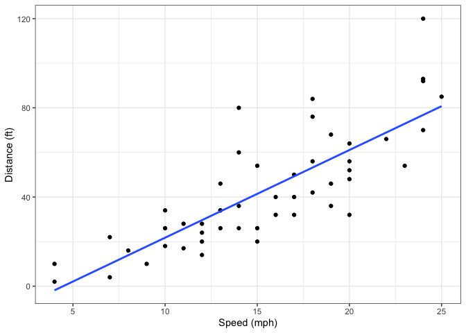
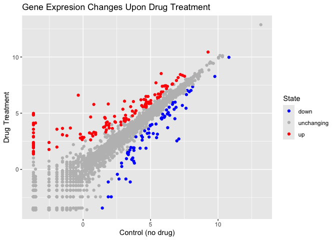
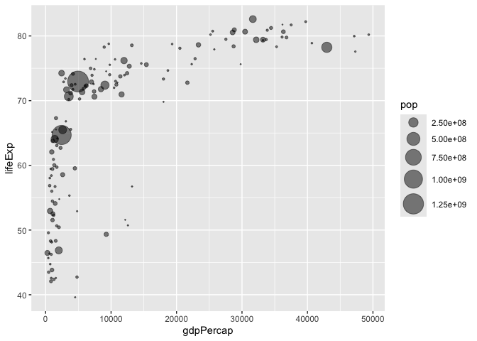
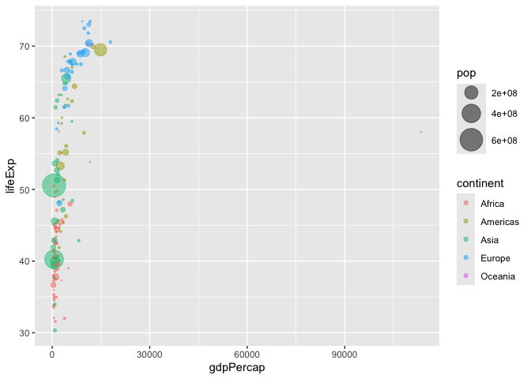
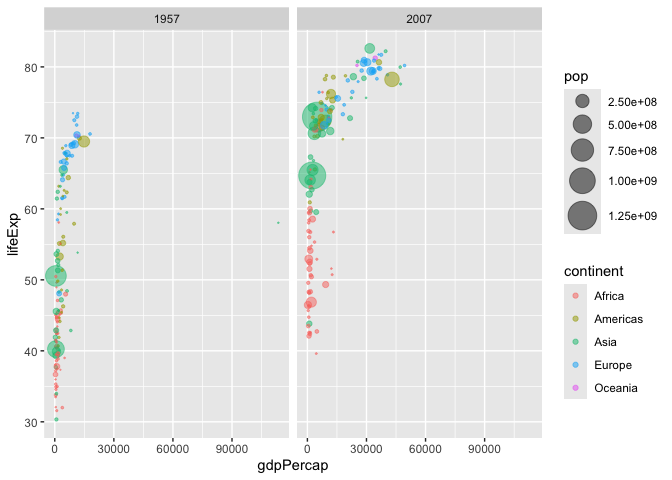

# Class 5: Data Viz with ggplot
Emily Hendrickson (PID: A69034780)

There are lots of ways to make figures and graphs using R. The first
way, which is a built-in function in **“base” R**, is the *plot()*
function.

``` r
plot(cars)
```


Another popular way to make figures and graphs is using the add-on
package **gglot2**. However, you must install and load the package
before you can use it by executing the *install.packages(“ggplot2”)*
function.

``` r
library(ggplot2)
ggplot(cars) + 
  aes(x=speed, y=dist) +
  geom_point()
```


For “simple” plots like this one plot() will be much better suited.

You can make more complex plots easily with ggplot.

``` r
ggplot(cars) + 
  aes(x=speed, y=dist) +
  geom_point() + 
  geom_smooth(method = lm, se = FALSE) + 
  labs(x = "Speed (mph)", y = "Distance (ft)") + 
  theme_bw()
```

    `geom_smooth()` using formula = 'y ~ x'



Make a ggplot of *mtcars* using *mpg* vs *disp* and set the size of the
points to *hp* and set the color to *am*

``` r
ggplot(mtcars) + 
  aes(x=mpg, y=disp, size = hp) +
  geom_point(col = "blue")
```


Adding more plot aesthetics through *aes()*

First start by getting data.

``` r
url <- "https://bioboot.github.io/bimm143_S20/class-material/up_down_expression.txt"
genes <- read.delim(url)
head(genes)
```

            Gene Condition1 Condition2      State
    1      A4GNT -3.6808610 -3.4401355 unchanging
    2       AAAS  4.5479580  4.3864126 unchanging
    3      AASDH  3.7190695  3.4787276 unchanging
    4       AATF  5.0784720  5.0151916 unchanging
    5       AATK  0.4711421  0.5598642 unchanging
    6 AB015752.4 -3.6808610 -3.5921390 unchanging

Making a figure that compares the gene expression of a certain gene
between conditions 1 and 2, where state indicates if expression is
significantly changed and in which direction.

``` r
ggplot(genes) + 
  aes(x=Condition1, y=Condition2, col=State) +
  geom_point()
```


Changing from default colors and adding titles.

``` r
p <- ggplot(genes) + 
  aes(x=Condition1, y=Condition2, col=State) +
  geom_point()
p + scale_color_manual(values = c("blue", "gray", "red")) + labs(title = "Gene Expresion Changes Upon Drug Treatment", x="Control (no drug)", y="Drug Treatment")
```



Additional work comparing life expectancy and GDP across continents and
countries for 2007.

``` r
suppressMessages(library(gapminder))
suppressMessages(library(dplyr, ))
gapminder_2007 <- gapminder %>% filter(year==2007)

ggplot(gapminder_2007) + 
  aes(x=gdpPercap, y=lifeExp,  size = pop) +
  geom_point(alpha=0.5) +
  scale_size_area(max_size = 10)
```



Next, for 1957.

``` r
suppressMessages(library(gapminder))
suppressMessages(library(dplyr, ))
gapminder_1957 <- gapminder %>% filter(year==1957)

ggplot(gapminder_1957) + 
  aes(x=gdpPercap, y=lifeExp,  size = pop, col = continent) +
  geom_point(alpha=0.5) +
  scale_size_area(max_size = 10)
```



Next, combining the figures for 2007 and 1957.

``` r
gapminder_1957_2007 <- gapminder %>% filter(year == 1957 | year ==2007)

ggplot(gapminder_1957_2007) +
  aes(x=gdpPercap, y=lifeExp, size = pop, col = continent) +
  geom_point(alpha=0.5) +
  scale_size_area(max_size=10) +
  facet_wrap(~year)
```



Extensions: Animation

``` r
#library(gapminder)
#library(gganimate)

#ggplot(gapminder) + 
#  aes(gdpPercap, lifeExp, size = pop, color = country) +
#  geom_point(alpha = 0.7, show.legend = FALSE) +
#  scale_color_manual(values = country_colors) + 
#  scale_size(range = c(2,12))+ 
#  scale_x_log10() + 
#  facet_wrap(~continent) +
#  labs(title = 'Year: {frame_time}', x = 'GDP per capita', y = 'life expectancy') +
#  transition_time(year) + 
#  shadow_wake(wake_length = 0.1, alpha = FALSE)
```
