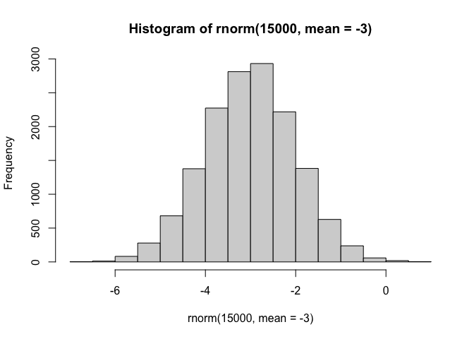
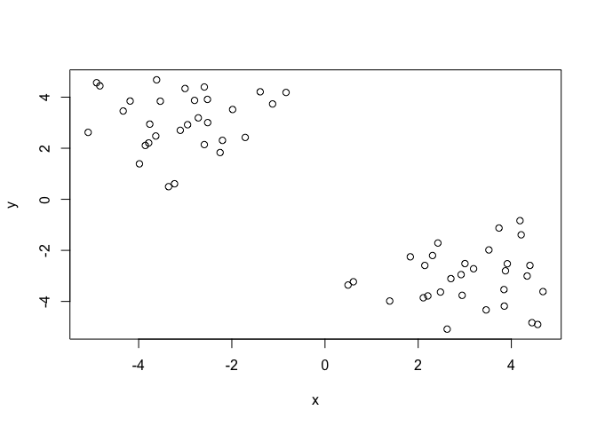
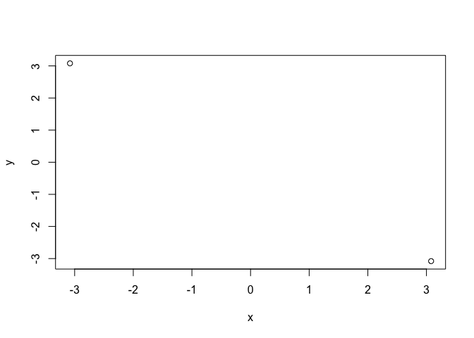
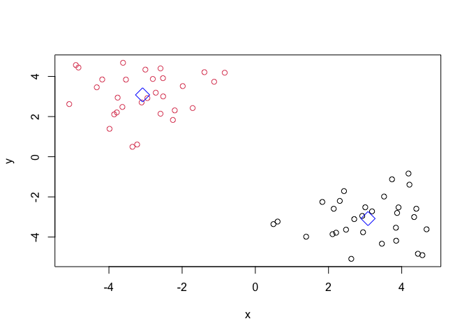
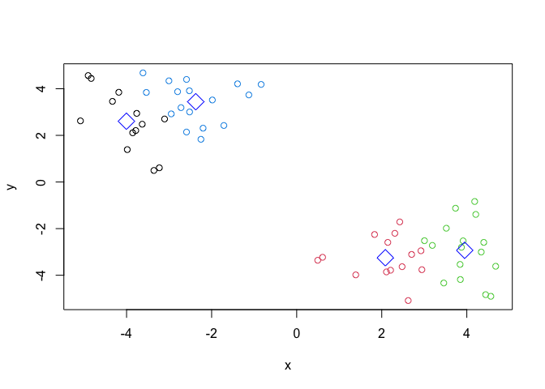
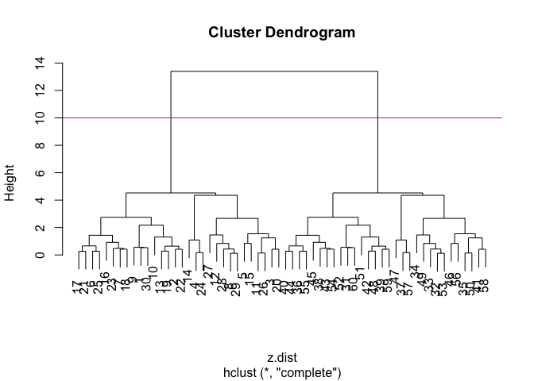
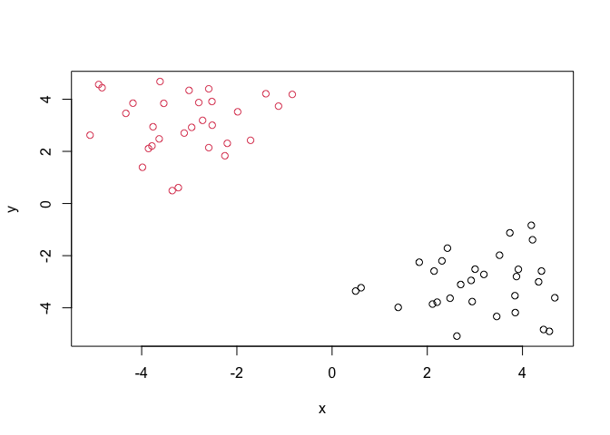
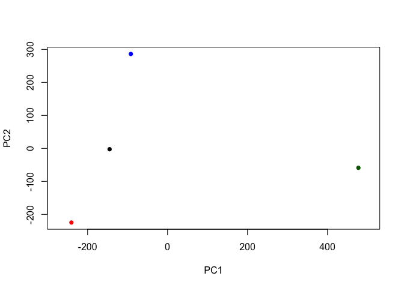
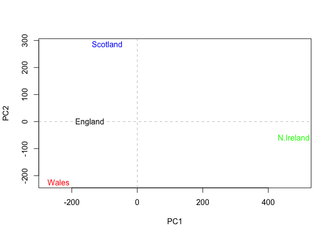

# Class 7: Machine Learning 1
Emily Hendrickson (PID: A69034780)

First, make a control dataset to run tests for clustering methods.

To do this, I will use the *rnorm()* function.

``` r
hist(rnorm(15000, mean = -3))
```



``` r
n=30
x <- c(rnorm(n, mean = 3), rnorm(n, mean = -3))
y <- rev(x)

z <- cbind(x,y)
z
```

                   x          y
     [1,]  4.1852393 -0.8362894
     [2,]  4.3986755 -2.5905974
     [3,]  3.8483470 -4.1830121
     [4,]  0.4946509 -3.3575531
     [5,]  4.6789315 -3.6144751
     [6,]  3.0039120 -2.5180192
     [7,]  2.3081500 -2.2013434
     [8,]  2.1099984 -3.8566080
     [9,]  4.2106917 -1.3908982
    [10,]  3.5178796 -1.9830021
    [11,]  4.5652698 -4.9027061
    [12,]  2.9435759 -3.7615511
    [13,]  3.8737421 -2.8003406
    [14,]  1.3891390 -3.9833958
    [15,]  3.8415487 -3.5353686
    [16,]  2.4231448 -1.7125865
    [17,]  2.9214412 -2.9497361
    [18,]  2.1422428 -2.5905679
    [19,]  3.9129873 -2.5233528
    [20,]  3.4582390 -4.3318197
    [21,]  2.7021137 -3.1065361
    [22,]  4.3389155 -3.0042425
    [23,]  1.8312587 -2.2515896
    [24,]  0.6087994 -3.2295888
    [25,]  3.1890459 -2.7201380
    [26,]  4.4424099 -4.8323315
    [27,]  2.6219359 -5.0845354
    [28,]  2.4787403 -3.6322055
    [29,]  2.2072248 -3.7843561
    [30,]  3.7348344 -1.1249237
    [31,] -1.1249237  3.7348344
    [32,] -3.7843561  2.2072248
    [33,] -3.6322055  2.4787403
    [34,] -5.0845354  2.6219359
    [35,] -4.8323315  4.4424099
    [36,] -2.7201380  3.1890459
    [37,] -3.2295888  0.6087994
    [38,] -2.2515896  1.8312587
    [39,] -3.0042425  4.3389155
    [40,] -3.1065361  2.7021137
    [41,] -4.3318197  3.4582390
    [42,] -2.5233528  3.9129873
    [43,] -2.5905679  2.1422428
    [44,] -2.9497361  2.9214412
    [45,] -1.7125865  2.4231448
    [46,] -3.5353686  3.8415487
    [47,] -3.9833958  1.3891390
    [48,] -2.8003406  3.8737421
    [49,] -3.7615511  2.9435759
    [50,] -4.9027061  4.5652698
    [51,] -1.9830021  3.5178796
    [52,] -1.3908982  4.2106917
    [53,] -3.8566080  2.1099984
    [54,] -2.2013434  2.3081500
    [55,] -2.5180192  3.0039120
    [56,] -3.6144751  4.6789315
    [57,] -3.3575531  0.4946509
    [58,] -4.1830121  3.8483470
    [59,] -2.5905974  4.3986755
    [60,] -0.8362894  4.1852393

``` r
plot(z)
```



K-means Clustering

To perform k-means clustering, use the function *kmeans()*

``` r
km <- kmeans(z, 2)
km
```

    K-means clustering with 2 clusters of sizes 30, 30

    Cluster means:
              x         y
    1  3.079436 -3.079789
    2 -3.079789  3.079436

    Clustering vector:
     [1] 1 1 1 1 1 1 1 1 1 1 1 1 1 1 1 1 1 1 1 1 1 1 1 1 1 1 1 1 1 1 2 2 2 2 2 2 2 2
    [39] 2 2 2 2 2 2 2 2 2 2 2 2 2 2 2 2 2 2 2 2 2 2

    Within cluster sum of squares by cluster:
    [1] 71.34343 71.34343
     (between_SS / total_SS =  88.9 %)

    Available components:

    [1] "cluster"      "centers"      "totss"        "withinss"     "tot.withinss"
    [6] "betweenss"    "size"         "iter"         "ifault"      

``` r
plot(km$centers)
```



Print the cluster vector and add cluster centers

``` r
km$cluster
```

     [1] 1 1 1 1 1 1 1 1 1 1 1 1 1 1 1 1 1 1 1 1 1 1 1 1 1 1 1 1 1 1 2 2 2 2 2 2 2 2
    [39] 2 2 2 2 2 2 2 2 2 2 2 2 2 2 2 2 2 2 2 2 2 2

``` r
plot(z, col = km$cluster)
points(km$centers, cex = 2, col = "blue", pch = 5)
```



Can you cluster our data in *z* into four clusters please?

``` r
km4 <- kmeans(z, centers = 4)
plot(z, col = km4$cluster)
points(km4$centers, cex = 2, col = "blue", pch = 5)
```



Hierarchical Clustering

The main function in base R for heirarchical clustering is *hclust()*

Unlike k-means, I can’t just lazily pass in my data. I have to do some
work and make a distance matrix of my data.

``` r
z.dist <- dist(z)
z.hc <- hclust(z.dist)
plot(z.hc)
abline(h=10, col = "red")
```



To get my main clustering restult, I can cut my tree at a given height.

``` r
hc.grps <- cutree(z.hc, h=10)
hc.grps
```

     [1] 1 1 1 1 1 1 1 1 1 1 1 1 1 1 1 1 1 1 1 1 1 1 1 1 1 1 1 1 1 1 2 2 2 2 2 2 2 2
    [39] 2 2 2 2 2 2 2 2 2 2 2 2 2 2 2 2 2 2 2 2 2 2

``` r
plot(z, col = hc.grps)
```



Principal Component Analysis - Class 7 Lab

Q1

``` r
url <- "https://tinyurl.com/UK-foods"
x <- read.csv(url)
dim(x)
```

    [1] 17  5

Preview the first 6 rows

``` r
head(x)
```

                   X England Wales Scotland N.Ireland
    1         Cheese     105   103      103        66
    2  Carcass_meat      245   227      242       267
    3    Other_meat      685   803      750       586
    4           Fish     147   160      122        93
    5 Fats_and_oils      193   235      184       209
    6         Sugars     156   175      147       139

Note how the minus indexing works

``` r
rownames(x) <- x[,1]
x <- x[,-1]
head(x)
```

                   England Wales Scotland N.Ireland
    Cheese             105   103      103        66
    Carcass_meat       245   227      242       267
    Other_meat         685   803      750       586
    Fish               147   160      122        93
    Fats_and_oils      193   235      184       209
    Sugars             156   175      147       139

``` r
dim(x)
```

    [1] 17  4

Alternative approach:

``` r
x<- read.csv(url, row.names=1)
head(x)
```

                   England Wales Scotland N.Ireland
    Cheese             105   103      103        66
    Carcass_meat       245   227      242       267
    Other_meat         685   803      750       586
    Fish               147   160      122        93
    Fats_and_oils      193   235      184       209
    Sugars             156   175      147       139

Q2: I prefer the secon

Making a barplot

``` r
barplot(as.matrix(x), beside = T, col = rainbow(nrow(x)))
```


Changing the argument beside = T to the default beside = F makes the
following plot

``` r
barplot(as.matrix(x), beside = F, col = rainbow(nrow(x)))
```


Making pairs plot.

Q5 The code is generating plots of pairwise comparisons between each
food category for each country. X axis is the country in that row, and
the Y axis is the country in that column. If a dot falls on the
diagonal, it means the value for that dot is the same for each country.

``` r
pairs(x, col=rainbow(nrow(x)), pch = 16)
```


Q6

The main function to do PCA in base R is called *prcomp()* To analyze
our data with PCA, we need to transpose it.

``` r
pca <- prcomp(t(x))
summary(pca)
```

    Importance of components:
                                PC1      PC2      PC3       PC4
    Standard deviation     324.1502 212.7478 73.87622 2.921e-14
    Proportion of Variance   0.6744   0.2905  0.03503 0.000e+00
    Cumulative Proportion    0.6744   0.9650  1.00000 1.000e+00

Let’s see what’s inside

``` r
attributes(pca)
```

    $names
    [1] "sdev"     "rotation" "center"   "scale"    "x"       

    $class
    [1] "prcomp"

Q7

Our main result figure by plotting PC1 vs PC2.

``` r
plot(pca$x[,1], pca$x[,2], xlab="PC1", ylab="PC2", xlim=c(-270,500), col = c("black", "red", "blue", "darkgreen"), pch = 16)
```



With color

``` r
plot(pca$x[,1], pca$x[,2], xlab="PC1", ylab="PC2", xlim=c(-270,500), cex = 0)
text(pca$x[,1], pca$x[,2], colnames(x), col = c("black", "red", "blue", "green"))
abline(v=0, col = "gray", lty = 2)
abline(h=0, col = "gray", lty = 2)
```



Percent Variation

Variable loadings with PC1 because it captures most of the variance
(67%)

``` r
par(mar=c(10,3,0.35,0))
barplot(pca$rotation[,1], las=2)
```


``` r
par(mar=c(10,3,0.35,0))
barplot(pca$rotation[,2], las=2)
```


