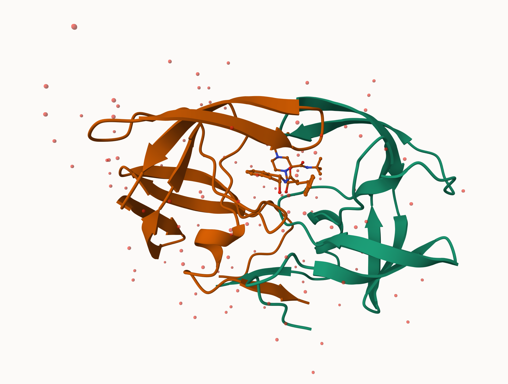
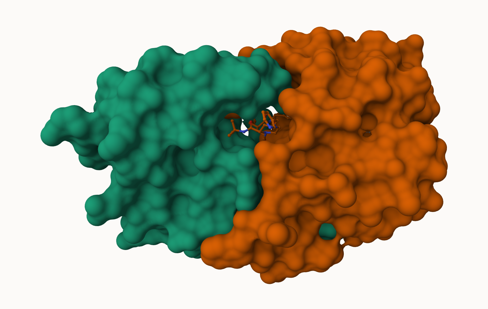
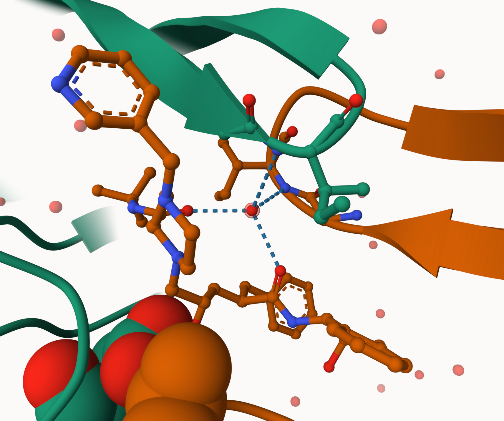

# Class 10: Structural Bioinformatics
Emily Hendrickson (PID: A69034780)

``` r
pdbstats <- read.csv("Data_Export_Summary.csv")
x <- pdbstats$Total
as.numeric(x)
```

    Warning: NAs introduced by coercion

    [1]  NA  NA  NA  NA 213  22

``` r
# Read the CSV file
data <- read.csv("Data_Export_Summary.csv", stringsAsFactors = FALSE)

# Remove commas within each value
data <- as.data.frame(lapply(data, function(x) gsub(",", "", x)))

# Convert only specific columns to numeric (replace with your column names or indices)
# For example, if columns 2 and 3 are numeric
data[, c(2:8)] <- lapply(data[,c(2:8)], as.numeric)

# Check the cleaned data
print(data)
```

               Molecular.Type  X.ray    EM   NMR Multiple.methods Neutron Other
    1          Protein (only) 167317 15698 12534              208      77    32
    2 Protein/Oligosaccharide   9645  2639    34                8       2     0
    3              Protein/NA   8735  4718   286                7       0     0
    4     Nucleic acid (only)   2869   138  1507               14       3     1
    5                   Other    170    10    33                0       0     0
    6  Oligosaccharide (only)     11     0     6                1       0     4
       Total
    1 195866
    2  12328
    3  13746
    4   4532
    5    213
    6     22

``` r
library(readr)
pdbstats <- read_csv("Data_Export_Summary.csv")
```

    Rows: 6 Columns: 8
    ── Column specification ────────────────────────────────────────────────────────
    Delimiter: ","
    chr (1): Molecular Type
    dbl (3): Multiple methods, Neutron, Other
    num (4): X-ray, EM, NMR, Total

    ℹ Use `spec()` to retrieve the full column specification for this data.
    ℹ Specify the column types or set `show_col_types = FALSE` to quiet this message.

``` r
pdbstats
```

    # A tibble: 6 × 8
      `Molecular Type`   `X-ray`    EM   NMR `Multiple methods` Neutron Other  Total
      <chr>                <dbl> <dbl> <dbl>              <dbl>   <dbl> <dbl>  <dbl>
    1 Protein (only)      167317 15698 12534                208      77    32 195866
    2 Protein/Oligosacc…    9645  2639    34                  8       2     0  12328
    3 Protein/NA            8735  4718   286                  7       0     0  13746
    4 Nucleic acid (onl…    2869   138  1507                 14       3     1   4532
    5 Other                  170    10    33                  0       0     0    213
    6 Oligosaccharide (…      11     0     6                  1       0     4     22

**Q1: What percentage of structures in the PDB are solved by X-Ray and
Electron Microscopy.**

``` r
xray <-  sum(data$X.ray) / sum(data$Total) * 100
xray
```

    [1] 83.25592

``` r
EM <-  sum(data$EM) / sum(data$Total) * 100
EM
```

    [1] 10.2348

**Q2: What proportion of structures in the PDB are protein?**

``` r
sum(pdbstats[1:3,8]) / sum(data$Total) * 100
```

    [1] 97.89729

**Q3: Type HIV in the PDB website search box on the home page and
determine how many HIV-1 protease structures are in the current PDB?**

4,563

\#Using Mol\*







pdb \<- read.pdb(“1hsg”)

``` r
library(bio3d)
```

    Warning: package 'bio3d' was built under R version 4.3.3

``` r
pdb <- read.pdb("1hsg")
```

      Note: Accessing on-line PDB file

``` r
pdb
```


     Call:  read.pdb(file = "1hsg")

       Total Models#: 1
         Total Atoms#: 1686,  XYZs#: 5058  Chains#: 2  (values: A B)

         Protein Atoms#: 1514  (residues/Calpha atoms#: 198)
         Nucleic acid Atoms#: 0  (residues/phosphate atoms#: 0)

         Non-protein/nucleic Atoms#: 172  (residues: 128)
         Non-protein/nucleic resid values: [ HOH (127), MK1 (1) ]

       Protein sequence:
          PQITLWQRPLVTIKIGGQLKEALLDTGADDTVLEEMSLPGRWKPKMIGGIGGFIKVRQYD
          QILIEICGHKAIGTVLVGPTPVNIIGRNLLTQIGCTLNFPQITLWQRPLVTIKIGGQLKE
          ALLDTGADDTVLEEMSLPGRWKPKMIGGIGGFIKVRQYDQILIEICGHKAIGTVLVGPTP
          VNIIGRNLLTQIGCTLNF

    + attr: atom, xyz, seqres, helix, sheet,
            calpha, remark, call

**Q7: How many amino acid residues are there in this pdb object?**

**Q8: Name one of the two non-protein residues?**

**Q9: How many protein chains are in this structure?**

``` r
attributes(pdb)
```

    $names
    [1] "atom"   "xyz"    "seqres" "helix"  "sheet"  "calpha" "remark" "call"  

    $class
    [1] "pdb" "sse"

``` r
head(pdb$atom)
```

      type eleno elety  alt resid chain resno insert      x      y     z o     b
    1 ATOM     1     N <NA>   PRO     A     1   <NA> 29.361 39.686 5.862 1 38.10
    2 ATOM     2    CA <NA>   PRO     A     1   <NA> 30.307 38.663 5.319 1 40.62
    3 ATOM     3     C <NA>   PRO     A     1   <NA> 29.760 38.071 4.022 1 42.64
    4 ATOM     4     O <NA>   PRO     A     1   <NA> 28.600 38.302 3.676 1 43.40
    5 ATOM     5    CB <NA>   PRO     A     1   <NA> 30.508 37.541 6.342 1 37.87
    6 ATOM     6    CG <NA>   PRO     A     1   <NA> 29.296 37.591 7.162 1 38.40
      segid elesy charge
    1  <NA>     N   <NA>
    2  <NA>     C   <NA>
    3  <NA>     C   <NA>
    4  <NA>     O   <NA>
    5  <NA>     C   <NA>
    6  <NA>     C   <NA>

\*\*Predicting functional motions of a single structure

``` r
adk <- read.pdb("6s36")
```

      Note: Accessing on-line PDB file
       PDB has ALT records, taking A only, rm.alt=TRUE

``` r
adk
```


     Call:  read.pdb(file = "6s36")

       Total Models#: 1
         Total Atoms#: 1898,  XYZs#: 5694  Chains#: 1  (values: A)

         Protein Atoms#: 1654  (residues/Calpha atoms#: 214)
         Nucleic acid Atoms#: 0  (residues/phosphate atoms#: 0)

         Non-protein/nucleic Atoms#: 244  (residues: 244)
         Non-protein/nucleic resid values: [ CL (3), HOH (238), MG (2), NA (1) ]

       Protein sequence:
          MRIILLGAPGAGKGTQAQFIMEKYGIPQISTGDMLRAAVKSGSELGKQAKDIMDAGKLVT
          DELVIALVKERIAQEDCRNGFLLDGFPRTIPQADAMKEAGINVDYVLEFDVPDELIVDKI
          VGRRVHAPSGRVYHVKFNPPKVEGKDDVTGEELTTRKDDQEETVRKRLVEYHQMTAPLIG
          YYSKEAEAGNTKYAKVDGTKPVAEVRADLEKILG

    + attr: atom, xyz, seqres, helix, sheet,
            calpha, remark, call

Performing flexibility prediction

``` r
#source("https://tinyurl.com/viewpdb")
#install.packages("r3dmol")
#library(r3dmol)

#view.pdb(pdb,backgroundColor = "white")
```

``` r
#view.pdb(adk, backgroundColor = "white")
```

``` r
modes <- nma(adk)
```

     Building Hessian...        Done in 0.014 seconds.
     Diagonalizing Hessian...   Done in 0.28 seconds.

``` r
plot(modes)
```


``` r
mktrj(modes, pdb = adk, file="adk_m7.pdb")
```
