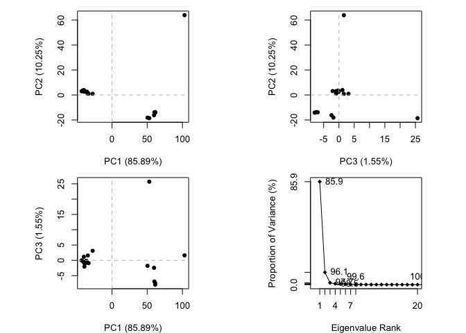
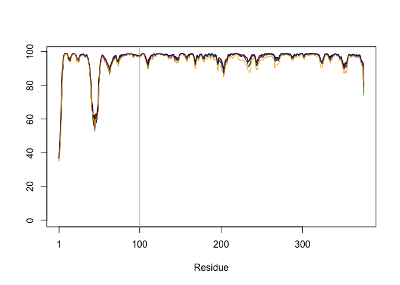

# Structural Bioinformatics pt 2
Emily Hendrickson (PID: A69034780)

First, finish last week’s stuff.

``` r
library(bio3d)
```

    Warning: package 'bio3d' was built under R version 4.3.3

``` r
id <- "1ake_A"
aa <- get.seq(id)
```

    Warning in get.seq(id): Removing existing file: seqs.fasta

    Fetching... Please wait. Done.

``` r
aa
```

                 1        .         .         .         .         .         60 
    pdb|1AKE|A   MRIILLGAPGAGKGTQAQFIMEKYGIPQISTGDMLRAAVKSGSELGKQAKDIMDAGKLVT
                 1        .         .         .         .         .         60 

                61        .         .         .         .         .         120 
    pdb|1AKE|A   DELVIALVKERIAQEDCRNGFLLDGFPRTIPQADAMKEAGINVDYVLEFDVPDELIVDRI
                61        .         .         .         .         .         120 

               121        .         .         .         .         .         180 
    pdb|1AKE|A   VGRRVHAPSGRVYHVKFNPPKVEGKDDVTGEELTTRKDDQEETVRKRLVEYHQMTAPLIG
               121        .         .         .         .         .         180 

               181        .         .         .   214 
    pdb|1AKE|A   YYSKEAEAGNTKYAKVDGTKPVAEVRADLEKILG
               181        .         .         .   214 

    Call:
      read.fasta(file = outfile)

    Class:
      fasta

    Alignment dimensions:
      1 sequence rows; 214 position columns (214 non-gap, 0 gap) 

    + attr: id, ali, call

``` r
b <- blast.pdb(aa)
```

     Searching ... please wait (updates every 5 seconds) RID = N6ZWKR49013 
     ......
     Reporting 86 hits

``` r
hits <- plot(b)
```

      * Possible cutoff values:    197 11 
                Yielding Nhits:    19 86 

      * Chosen cutoff value of:    197 
                Yielding Nhits:    19 


``` r
files <- get.pdb(hits$pdb.id, path = "pdbs", split = TRUE, gzip = TRUE)
```

    Warning in get.pdb(hits$pdb.id, path = "pdbs", split = TRUE, gzip = TRUE):
    pdbs/1AKE.pdb.gz exists. Skipping download

    Warning in get.pdb(hits$pdb.id, path = "pdbs", split = TRUE, gzip = TRUE):
    pdbs/8BQF.pdb.gz exists. Skipping download

    Warning in get.pdb(hits$pdb.id, path = "pdbs", split = TRUE, gzip = TRUE):
    pdbs/4X8M.pdb.gz exists. Skipping download

    Warning in get.pdb(hits$pdb.id, path = "pdbs", split = TRUE, gzip = TRUE):
    pdbs/6S36.pdb.gz exists. Skipping download

    Warning in get.pdb(hits$pdb.id, path = "pdbs", split = TRUE, gzip = TRUE):
    pdbs/8Q2B.pdb.gz exists. Skipping download

    Warning in get.pdb(hits$pdb.id, path = "pdbs", split = TRUE, gzip = TRUE):
    pdbs/8RJ9.pdb.gz exists. Skipping download

    Warning in get.pdb(hits$pdb.id, path = "pdbs", split = TRUE, gzip = TRUE):
    pdbs/6RZE.pdb.gz exists. Skipping download

    Warning in get.pdb(hits$pdb.id, path = "pdbs", split = TRUE, gzip = TRUE):
    pdbs/4X8H.pdb.gz exists. Skipping download

    Warning in get.pdb(hits$pdb.id, path = "pdbs", split = TRUE, gzip = TRUE):
    pdbs/3HPR.pdb.gz exists. Skipping download

    Warning in get.pdb(hits$pdb.id, path = "pdbs", split = TRUE, gzip = TRUE):
    pdbs/1E4V.pdb.gz exists. Skipping download

    Warning in get.pdb(hits$pdb.id, path = "pdbs", split = TRUE, gzip = TRUE):
    pdbs/5EJE.pdb.gz exists. Skipping download

    Warning in get.pdb(hits$pdb.id, path = "pdbs", split = TRUE, gzip = TRUE):
    pdbs/1E4Y.pdb.gz exists. Skipping download

    Warning in get.pdb(hits$pdb.id, path = "pdbs", split = TRUE, gzip = TRUE):
    pdbs/3X2S.pdb.gz exists. Skipping download

    Warning in get.pdb(hits$pdb.id, path = "pdbs", split = TRUE, gzip = TRUE):
    pdbs/6HAP.pdb.gz exists. Skipping download

    Warning in get.pdb(hits$pdb.id, path = "pdbs", split = TRUE, gzip = TRUE):
    pdbs/6HAM.pdb.gz exists. Skipping download

    Warning in get.pdb(hits$pdb.id, path = "pdbs", split = TRUE, gzip = TRUE):
    pdbs/4K46.pdb.gz exists. Skipping download

    Warning in get.pdb(hits$pdb.id, path = "pdbs", split = TRUE, gzip = TRUE):
    pdbs/4NP6.pdb.gz exists. Skipping download

    Warning in get.pdb(hits$pdb.id, path = "pdbs", split = TRUE, gzip = TRUE):
    pdbs/3GMT.pdb.gz exists. Skipping download

    Warning in get.pdb(hits$pdb.id, path = "pdbs", split = TRUE, gzip = TRUE):
    pdbs/4PZL.pdb.gz exists. Skipping download


      |                                                                            
      |                                                                      |   0%
      |                                                                            
      |====                                                                  |   5%
      |                                                                            
      |=======                                                               |  11%
      |                                                                            
      |===========                                                           |  16%
      |                                                                            
      |===============                                                       |  21%
      |                                                                            
      |==================                                                    |  26%
      |                                                                            
      |======================                                                |  32%
      |                                                                            
      |==========================                                            |  37%
      |                                                                            
      |=============================                                         |  42%
      |                                                                            
      |=================================                                     |  47%
      |                                                                            
      |=====================================                                 |  53%
      |                                                                            
      |=========================================                             |  58%
      |                                                                            
      |============================================                          |  63%
      |                                                                            
      |================================================                      |  68%
      |                                                                            
      |====================================================                  |  74%
      |                                                                            
      |=======================================================               |  79%
      |                                                                            
      |===========================================================           |  84%
      |                                                                            
      |===============================================================       |  89%
      |                                                                            
      |==================================================================    |  95%
      |                                                                            
      |======================================================================| 100%

I have now downloaded the all the ADK structures in the PDB database but
viewing them is challenging. They need to be aligned and superposed. I
already had BiocManager installed and installed the pdbaln package using
BiocManager::install()

``` r
pdbs <- pdbaln(files, fit = TRUE, exefile="msa")
```

    Reading PDB files:
    pdbs/split_chain/1AKE_A.pdb
    pdbs/split_chain/8BQF_A.pdb
    pdbs/split_chain/4X8M_A.pdb
    pdbs/split_chain/6S36_A.pdb
    pdbs/split_chain/8Q2B_A.pdb
    pdbs/split_chain/8RJ9_A.pdb
    pdbs/split_chain/6RZE_A.pdb
    pdbs/split_chain/4X8H_A.pdb
    pdbs/split_chain/3HPR_A.pdb
    pdbs/split_chain/1E4V_A.pdb
    pdbs/split_chain/5EJE_A.pdb
    pdbs/split_chain/1E4Y_A.pdb
    pdbs/split_chain/3X2S_A.pdb
    pdbs/split_chain/6HAP_A.pdb
    pdbs/split_chain/6HAM_A.pdb
    pdbs/split_chain/4K46_A.pdb
    pdbs/split_chain/4NP6_A.pdb
    pdbs/split_chain/3GMT_A.pdb
    pdbs/split_chain/4PZL_A.pdb
       PDB has ALT records, taking A only, rm.alt=TRUE
    .   PDB has ALT records, taking A only, rm.alt=TRUE
    ..   PDB has ALT records, taking A only, rm.alt=TRUE
    .   PDB has ALT records, taking A only, rm.alt=TRUE
    .   PDB has ALT records, taking A only, rm.alt=TRUE
    .   PDB has ALT records, taking A only, rm.alt=TRUE
    ..   PDB has ALT records, taking A only, rm.alt=TRUE
    ..   PDB has ALT records, taking A only, rm.alt=TRUE
    ....   PDB has ALT records, taking A only, rm.alt=TRUE
    .   PDB has ALT records, taking A only, rm.alt=TRUE
    ....

    Extracting sequences

    pdb/seq: 1   name: pdbs/split_chain/1AKE_A.pdb 
       PDB has ALT records, taking A only, rm.alt=TRUE
    pdb/seq: 2   name: pdbs/split_chain/8BQF_A.pdb 
       PDB has ALT records, taking A only, rm.alt=TRUE
    pdb/seq: 3   name: pdbs/split_chain/4X8M_A.pdb 
    pdb/seq: 4   name: pdbs/split_chain/6S36_A.pdb 
       PDB has ALT records, taking A only, rm.alt=TRUE
    pdb/seq: 5   name: pdbs/split_chain/8Q2B_A.pdb 
       PDB has ALT records, taking A only, rm.alt=TRUE
    pdb/seq: 6   name: pdbs/split_chain/8RJ9_A.pdb 
       PDB has ALT records, taking A only, rm.alt=TRUE
    pdb/seq: 7   name: pdbs/split_chain/6RZE_A.pdb 
       PDB has ALT records, taking A only, rm.alt=TRUE
    pdb/seq: 8   name: pdbs/split_chain/4X8H_A.pdb 
    pdb/seq: 9   name: pdbs/split_chain/3HPR_A.pdb 
       PDB has ALT records, taking A only, rm.alt=TRUE
    pdb/seq: 10   name: pdbs/split_chain/1E4V_A.pdb 
    pdb/seq: 11   name: pdbs/split_chain/5EJE_A.pdb 
       PDB has ALT records, taking A only, rm.alt=TRUE
    pdb/seq: 12   name: pdbs/split_chain/1E4Y_A.pdb 
    pdb/seq: 13   name: pdbs/split_chain/3X2S_A.pdb 
    pdb/seq: 14   name: pdbs/split_chain/6HAP_A.pdb 
    pdb/seq: 15   name: pdbs/split_chain/6HAM_A.pdb 
       PDB has ALT records, taking A only, rm.alt=TRUE
    pdb/seq: 16   name: pdbs/split_chain/4K46_A.pdb 
       PDB has ALT records, taking A only, rm.alt=TRUE
    pdb/seq: 17   name: pdbs/split_chain/4NP6_A.pdb 
    pdb/seq: 18   name: pdbs/split_chain/3GMT_A.pdb 
    pdb/seq: 19   name: pdbs/split_chain/4PZL_A.pdb 

\##Principal Component Analysis

``` r
pc <- pca(pdbs)
plot(pc)
```



``` r
plot(pc, pc.axes = c(1:2))
```


visualize the structural components of the variation in xray structures
that is described by PC1.

``` r
pc1 <- mktrj(pc, pc=1, file="pc_1.pdb")
```

**AlphaFold**

I used the predicted protein sequence from my find a gene project.


``` r
results_dir <- "test_3910f/"
pdb_files <- list.files(path=results_dir,
                        pattern="*.pdb",
                        full.names = TRUE)
basename(pdb_files)
```

    [1] "test_3910f_unrelaxed_rank_001_alphafold2_ptm_model_4_seed_000.pdb"
    [2] "test_3910f_unrelaxed_rank_002_alphafold2_ptm_model_1_seed_000.pdb"
    [3] "test_3910f_unrelaxed_rank_003_alphafold2_ptm_model_5_seed_000.pdb"
    [4] "test_3910f_unrelaxed_rank_004_alphafold2_ptm_model_3_seed_000.pdb"
    [5] "test_3910f_unrelaxed_rank_005_alphafold2_ptm_model_2_seed_000.pdb"

``` r
library(bio3d)
pdbs <- pdbaln(pdb_files, fit=TRUE, exefile="msa")
```

    Reading PDB files:
    test_3910f//test_3910f_unrelaxed_rank_001_alphafold2_ptm_model_4_seed_000.pdb
    test_3910f//test_3910f_unrelaxed_rank_002_alphafold2_ptm_model_1_seed_000.pdb
    test_3910f//test_3910f_unrelaxed_rank_003_alphafold2_ptm_model_5_seed_000.pdb
    test_3910f//test_3910f_unrelaxed_rank_004_alphafold2_ptm_model_3_seed_000.pdb
    test_3910f//test_3910f_unrelaxed_rank_005_alphafold2_ptm_model_2_seed_000.pdb
    .....

    Extracting sequences

    pdb/seq: 1   name: test_3910f//test_3910f_unrelaxed_rank_001_alphafold2_ptm_model_4_seed_000.pdb 
    pdb/seq: 2   name: test_3910f//test_3910f_unrelaxed_rank_002_alphafold2_ptm_model_1_seed_000.pdb 
    pdb/seq: 3   name: test_3910f//test_3910f_unrelaxed_rank_003_alphafold2_ptm_model_5_seed_000.pdb 
    pdb/seq: 4   name: test_3910f//test_3910f_unrelaxed_rank_004_alphafold2_ptm_model_3_seed_000.pdb 
    pdb/seq: 5   name: test_3910f//test_3910f_unrelaxed_rank_005_alphafold2_ptm_model_2_seed_000.pdb 

``` r
pdbs
```

                                   1        .         .         .         .         50 
    [Truncated_Name:1]test_3910f   CDEEVAALVVDNGSGMCKAGFAGDDAPRAVFPSIVGRPRHQGVMVGMGQK
    [Truncated_Name:2]test_3910f   CDEEVAALVVDNGSGMCKAGFAGDDAPRAVFPSIVGRPRHQGVMVGMGQK
    [Truncated_Name:3]test_3910f   CDEEVAALVVDNGSGMCKAGFAGDDAPRAVFPSIVGRPRHQGVMVGMGQK
    [Truncated_Name:4]test_3910f   CDEEVAALVVDNGSGMCKAGFAGDDAPRAVFPSIVGRPRHQGVMVGMGQK
    [Truncated_Name:5]test_3910f   CDEEVAALVVDNGSGMCKAGFAGDDAPRAVFPSIVGRPRHQGVMVGMGQK
                                   ************************************************** 
                                   1        .         .         .         .         50 

                                  51        .         .         .         .         100 
    [Truncated_Name:1]test_3910f   DSYVGDEAQSKRGILTLKYPIEHGIVTNWDDMEKIWHHTFYNELRVAPEE
    [Truncated_Name:2]test_3910f   DSYVGDEAQSKRGILTLKYPIEHGIVTNWDDMEKIWHHTFYNELRVAPEE
    [Truncated_Name:3]test_3910f   DSYVGDEAQSKRGILTLKYPIEHGIVTNWDDMEKIWHHTFYNELRVAPEE
    [Truncated_Name:4]test_3910f   DSYVGDEAQSKRGILTLKYPIEHGIVTNWDDMEKIWHHTFYNELRVAPEE
    [Truncated_Name:5]test_3910f   DSYVGDEAQSKRGILTLKYPIEHGIVTNWDDMEKIWHHTFYNELRVAPEE
                                   ************************************************** 
                                  51        .         .         .         .         100 

                                 101        .         .         .         .         150 
    [Truncated_Name:1]test_3910f   HPVLLTEAPLNPKANREKMTQIMFETFNTPAMYVAIQAVLSLYASGRTTG
    [Truncated_Name:2]test_3910f   HPVLLTEAPLNPKANREKMTQIMFETFNTPAMYVAIQAVLSLYASGRTTG
    [Truncated_Name:3]test_3910f   HPVLLTEAPLNPKANREKMTQIMFETFNTPAMYVAIQAVLSLYASGRTTG
    [Truncated_Name:4]test_3910f   HPVLLTEAPLNPKANREKMTQIMFETFNTPAMYVAIQAVLSLYASGRTTG
    [Truncated_Name:5]test_3910f   HPVLLTEAPLNPKANREKMTQIMFETFNTPAMYVAIQAVLSLYASGRTTG
                                   ************************************************** 
                                 101        .         .         .         .         150 

                                 151        .         .         .         .         200 
    [Truncated_Name:1]test_3910f   IVLDSGDGVSHTVPIYEGYALPHAILRLDLAGRDLTDYLMKILTERGYSF
    [Truncated_Name:2]test_3910f   IVLDSGDGVSHTVPIYEGYALPHAILRLDLAGRDLTDYLMKILTERGYSF
    [Truncated_Name:3]test_3910f   IVLDSGDGVSHTVPIYEGYALPHAILRLDLAGRDLTDYLMKILTERGYSF
    [Truncated_Name:4]test_3910f   IVLDSGDGVSHTVPIYEGYALPHAILRLDLAGRDLTDYLMKILTERGYSF
    [Truncated_Name:5]test_3910f   IVLDSGDGVSHTVPIYEGYALPHAILRLDLAGRDLTDYLMKILTERGYSF
                                   ************************************************** 
                                 151        .         .         .         .         200 

                                 201        .         .         .         .         250 
    [Truncated_Name:1]test_3910f   TTTAEREIVRDIKEKLCYVALDFEQEMATAASSSSLEKSYELPDGQVITI
    [Truncated_Name:2]test_3910f   TTTAEREIVRDIKEKLCYVALDFEQEMATAASSSSLEKSYELPDGQVITI
    [Truncated_Name:3]test_3910f   TTTAEREIVRDIKEKLCYVALDFEQEMATAASSSSLEKSYELPDGQVITI
    [Truncated_Name:4]test_3910f   TTTAEREIVRDIKEKLCYVALDFEQEMATAASSSSLEKSYELPDGQVITI
    [Truncated_Name:5]test_3910f   TTTAEREIVRDIKEKLCYVALDFEQEMATAASSSSLEKSYELPDGQVITI
                                   ************************************************** 
                                 201        .         .         .         .         250 

                                 251        .         .         .         .         300 
    [Truncated_Name:1]test_3910f   GNERFRCPEALFQPSFLGMEACGIHETTYNSIMKCDVDIRKDLYANTVLS
    [Truncated_Name:2]test_3910f   GNERFRCPEALFQPSFLGMEACGIHETTYNSIMKCDVDIRKDLYANTVLS
    [Truncated_Name:3]test_3910f   GNERFRCPEALFQPSFLGMEACGIHETTYNSIMKCDVDIRKDLYANTVLS
    [Truncated_Name:4]test_3910f   GNERFRCPEALFQPSFLGMEACGIHETTYNSIMKCDVDIRKDLYANTVLS
    [Truncated_Name:5]test_3910f   GNERFRCPEALFQPSFLGMEACGIHETTYNSIMKCDVDIRKDLYANTVLS
                                   ************************************************** 
                                 251        .         .         .         .         300 

                                 301        .         .         .         .         350 
    [Truncated_Name:1]test_3910f   GGTTMYPGIADRMQKEITALAPSTMKIKIIAPPERKYSVWIGGSILASLS
    [Truncated_Name:2]test_3910f   GGTTMYPGIADRMQKEITALAPSTMKIKIIAPPERKYSVWIGGSILASLS
    [Truncated_Name:3]test_3910f   GGTTMYPGIADRMQKEITALAPSTMKIKIIAPPERKYSVWIGGSILASLS
    [Truncated_Name:4]test_3910f   GGTTMYPGIADRMQKEITALAPSTMKIKIIAPPERKYSVWIGGSILASLS
    [Truncated_Name:5]test_3910f   GGTTMYPGIADRMQKEITALAPSTMKIKIIAPPERKYSVWIGGSILASLS
                                   ************************************************** 
                                 301        .         .         .         .         350 

                                 351        .         .    375 
    [Truncated_Name:1]test_3910f   TFQQMWISKQEYDESGPSIVHRKCF
    [Truncated_Name:2]test_3910f   TFQQMWISKQEYDESGPSIVHRKCF
    [Truncated_Name:3]test_3910f   TFQQMWISKQEYDESGPSIVHRKCF
    [Truncated_Name:4]test_3910f   TFQQMWISKQEYDESGPSIVHRKCF
    [Truncated_Name:5]test_3910f   TFQQMWISKQEYDESGPSIVHRKCF
                                   ************************* 
                                 351        .         .    375 

    Call:
      pdbaln(files = pdb_files, fit = TRUE, exefile = "msa")

    Class:
      pdbs, fasta

    Alignment dimensions:
      5 sequence rows; 375 position columns (375 non-gap, 0 gap) 

    + attr: xyz, resno, b, chain, id, ali, resid, sse, call

``` r
rd <- rmsd(pdbs, fit=T)
```

    Warning in rmsd(pdbs, fit = T): No indices provided, using the 375 non NA positions

``` r
range(rd)
```

    [1] 0.000 0.398

``` r
library(pheatmap)

colnames(rd) <- paste0("m",1:5)
rownames(rd) <- paste0("m",1:5)
pheatmap(rd)
```


``` r
pdb <- read.pdb("1j6z")
```

      Note: Accessing on-line PDB file
       PDB has ALT records, taking A only, rm.alt=TRUE

``` r
plotb3(pdbs$b[1,], typ="l", lwd=2, sse=pdb)
```

    Warning in plotb3(pdbs$b[1, ], typ = "l", lwd = 2, sse = pdb): Length of input
    'sse' does not equal the length of input 'x'; Ignoring 'sse'

``` r
points(pdbs$b[2,], typ="l", col="red")
points(pdbs$b[3,], typ="l", col="blue")
points(pdbs$b[4,], typ="l", col="darkgreen")
points(pdbs$b[5,], typ="l", col="orange")
abline(v=100, col="gray")
```



``` r
core <- core.find(pdbs)
```

     core size 374 of 375  vol = 0.973 
     core size 373 of 375  vol = 0.841 
     core size 372 of 375  vol = 0.774 
     core size 371 of 375  vol = 0.72 
     core size 370 of 375  vol = 0.664 
     core size 369 of 375  vol = 0.629 
     core size 368 of 375  vol = 0.592 
     core size 367 of 375  vol = 0.567 
     core size 366 of 375  vol = 0.55 
     core size 365 of 375  vol = 0.536 
     core size 364 of 375  vol = 0.519 
     core size 363 of 375  vol = 0.506 
     core size 362 of 375  vol = 0.493 
     FINISHED: Min vol ( 0.5 ) reached

``` r
core.inds <- print(core, vol=0.5)
```

    # 363 positions (cumulative volume <= 0.5 Angstrom^3) 
      start end length
    1     3  41     39
    2    49 194    146
    3   198 375    178

``` r
xyz <- pdbfit(pdbs, core.inds, outpath="corefit_structures")
```


``` r
rf <- rmsf(xyz)

plotb3(rf, sse=pdb)
```

    Warning in plotb3(rf, sse = pdb): Length of input 'sse' does not equal the
    length of input 'x'; Ignoring 'sse'

``` r
abline(v=100, col="gray", ylab="RMSF")
```


**Predicted Alignment Error for domains**

``` r
library(jsonlite)
```

    Warning: package 'jsonlite' was built under R version 4.3.3

``` r
pae_files <- list.files(path=results_dir,
                        pattern=".*model.*\\.json",
                        full.names = TRUE)
pae1 <- read_json(pae_files[1],simplifyVector = TRUE)
pae5 <- read_json(pae_files[5],simplifyVector = TRUE)

attributes(pae1)
```

    $names
    [1] "plddt"   "max_pae" "pae"     "ptm"    

``` r
head(pae1$plddt) 
```

    [1] 36.53 46.22 54.09 74.19 88.12 93.88

Max pae scores

``` r
pae1$max_pae
```

    [1] 31.09375

``` r
pae5$max_pae
```

    [1] 30.9375

Plotted residue-by-residue pae scores for model 1 and 5

``` r
plot.dmat(pae1$pae, 
          xlab="Residue Position (i)",
          ylab="Residue Position (j)")
```


``` r
plot.dmat(pae5$pae, 
          xlab="Residue Position (i)",
          ylab="Residue Position (j)",
          grid.col = "black",
          zlim=c(0,30))
```


model 1 with range of 0-30

``` r
plot.dmat(pae1$pae, 
          xlab="Residue Position (i)",
          ylab="Residue Position (j)",
          grid.col = "black",
          zlim=c(0,30))
```


**Residue conservation from alignment file**

``` r
aln_file <- list.files(path=results_dir,
                       pattern=".a3m$",
                        full.names = TRUE)
aln_file
```

    [1] "test_3910f//test_3910f.a3m"

``` r
aln <- read.fasta(aln_file[1], to.upper = TRUE)
```

    [1] " ** Duplicated sequence id's: 101 **"

``` r
# number of sequences 
dim(aln$ali)
```

    [1] 21157   757

Socring residue conservation

``` r
sim <- conserv(aln)
plotb3(sim[1:99], sse=trim.pdb(pdb, chain="A"),
       ylab="Conservation Score")
```

    Warning in plotb3(sim[1:99], sse = trim.pdb(pdb, chain = "A"), ylab =
    "Conservation Score"): Length of input 'sse' does not equal the length of input
    'x'; Ignoring 'sse'


``` r
con <- consensus(aln, cutoff = 0.25)
con$seq
```

      [1] "-" "-" "-" "-" "-" "-" "-" "-" "V" "-" "D" "N" "G" "S" "G" "-" "-" "K"
     [19] "A" "G" "F" "A" "G" "-" "D" "-" "P" "-" "-" "V" "F" "P" "S" "-" "V" "G"
     [37] "-" "P" "-" "-" "-" "-" "-" "-" "-" "-" "-" "-" "-" "-" "-" "-" "-" "-"
     [55] "G" "-" "-" "A" "-" "-" "-" "-" "-" "-" "L" "-" "L" "-" "-" "P" "-" "-"
     [73] "-" "G" "-" "-" "-" "-" "W" "D" "D" "M" "E" "-" "-" "W" "-" "H" "-" "F"
     [91] "-" "-" "-" "L" "-" "-" "-" "P" "-" "E" "-" "-" "-" "L" "L" "T" "E" "-"
    [109] "P" "L" "N" "P" "-" "-" "N" "R" "E" "-" "-" "-" "-" "-" "M" "F" "E" "-"
    [127] "F" "-" "-" "P" "A" "-" "Y" "-" "-" "-" "Q" "A" "V" "L" "S" "L" "Y" "A"
    [145] "S" "G" "R" "T" "T" "G" "-" "V" "-" "D" "S" "G" "D" "G" "V" "-" "H" "-"
    [163] "V" "P" "I" "Y" "E" "G" "Y" "-" "L" "P" "H" "A" "-" "-" "R" "L" "D" "L"
    [181] "A" "G" "R" "D" "L" "T" "-" "Y" "L" "-" "-" "L" "L" "-" "E" "-" "G" "-"
    [199] "-" "F" "-" "T" "-" "A" "E" "-" "E" "I" "V" "R" "D" "I" "K" "E" "K" "-"
    [217] "C" "Y" "V" "A" "-" "D" "-" "-" "-" "E" "-" "-" "-" "-" "-" "-" "-" "-"
    [235] "-" "-" "-" "-" "-" "Y" "-" "L" "P" "D" "G" "-" "-" "-" "-" "-" "G" "-"
    [253] "E" "R" "F" "-" "-" "P" "E" "-" "L" "F" "-" "P" "-" "-" "-" "G" "-" "-"
    [271] "-" "-" "G" "-" "-" "-" "-" "-" "-" "-" "-" "-" "-" "-" "-" "-" "-" "-"
    [289] "-" "-" "-" "-" "-" "-" "-" "-" "-" "-" "L" "-" "G" "G" "-" "-" "-" "-"
    [307] "-" "G" "-" "-" "-" "-" "-" "-" "-" "-" "-" "-" "-" "-" "-" "-" "-" "-"
    [325] "-" "-" "-" "-" "-" "-" "-" "-" "-" "-" "-" "-" "-" "-" "-" "-" "-" "-"
    [343] "-" "-" "-" "-" "-" "-" "-" "-" "-" "-" "-" "-" "-" "-" "-" "-" "-" "-"
    [361] "-" "-" "-" "-" "-" "-" "-" "-" "-" "-" "-" "-" "-" "-" "-" "-" "-" "-"
    [379] "-" "-" "-" "-" "-" "-" "-" "-" "-" "-" "-" "-" "-" "-" "-" "-" "-" "-"
    [397] "-" "-" "-" "-" "-" "-" "-" "-" "-" "-" "-" "-" "-" "-" "-" "-" "-" "-"
    [415] "-" "-" "-" "-" "-" "-" "-" "-" "-" "-" "-" "-" "-" "-" "-" "-" "-" "-"
    [433] "-" "-" "-" "-" "-" "-" "-" "-" "-" "-" "-" "-" "-" "-" "-" "-" "-" "-"
    [451] "-" "-" "-" "-" "-" "-" "-" "-" "-" "-" "-" "-" "-" "-" "-" "-" "-" "-"
    [469] "-" "-" "-" "-" "-" "-" "-" "-" "-" "-" "-" "-" "-" "-" "-" "-" "-" "-"
    [487] "-" "-" "-" "-" "-" "-" "-" "-" "-" "-" "-" "-" "-" "-" "-" "-" "-" "-"
    [505] "-" "-" "-" "-" "-" "-" "-" "-" "-" "-" "-" "-" "-" "-" "-" "-" "-" "-"
    [523] "-" "-" "-" "-" "-" "-" "-" "-" "-" "-" "-" "-" "-" "-" "-" "-" "-" "-"
    [541] "-" "-" "-" "-" "-" "-" "-" "-" "-" "-" "-" "-" "-" "-" "-" "-" "-" "-"
    [559] "-" "-" "-" "-" "-" "-" "-" "-" "-" "-" "-" "-" "-" "-" "-" "-" "-" "-"
    [577] "-" "-" "-" "-" "-" "-" "-" "-" "-" "-" "-" "-" "-" "-" "-" "-" "-" "-"
    [595] "-" "-" "-" "-" "-" "-" "-" "-" "-" "-" "-" "-" "-" "-" "-" "-" "-" "-"
    [613] "-" "-" "-" "-" "-" "-" "-" "-" "-" "-" "-" "-" "-" "-" "-" "-" "-" "-"
    [631] "-" "-" "-" "-" "-" "-" "-" "-" "-" "-" "-" "-" "-" "-" "-" "-" "-" "-"
    [649] "-" "-" "-" "-" "-" "-" "-" "-" "-" "-" "-" "-" "-" "-" "-" "-" "-" "-"
    [667] "-" "-" "-" "-" "-" "-" "-" "-" "-" "-" "-" "-" "-" "-" "-" "-" "-" "-"
    [685] "-" "-" "-" "-" "-" "-" "-" "-" "-" "-" "-" "-" "-" "-" "-" "-" "-" "-"
    [703] "-" "-" "-" "-" "-" "-" "-" "-" "-" "-" "-" "-" "-" "-" "-" "-" "-" "-"
    [721] "-" "-" "-" "-" "-" "-" "-" "-" "-" "-" "-" "-" "-" "-" "-" "-" "-" "-"
    [739] "-" "-" "-" "-" "-" "-" "-" "-" "-" "-" "-" "-" "-" "-" "-" "-" "-" "-"
    [757] "-"
