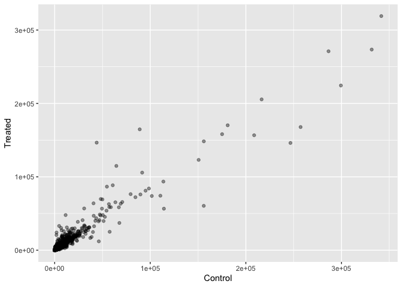
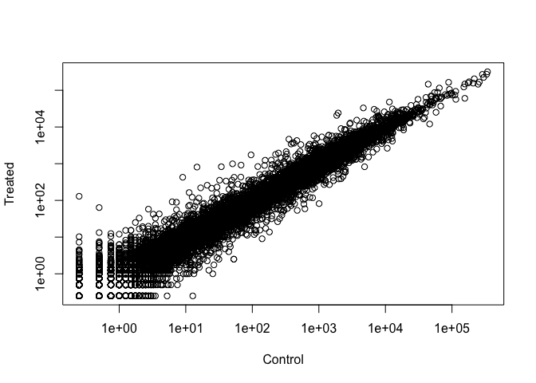
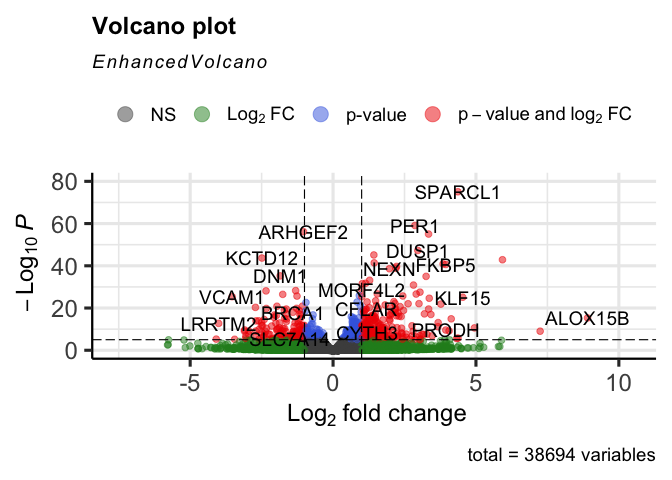

# Class 13: Transcriptomics and the analysis of RNA-Seq data
Emily Hendrickson (PID: A69034780)

RNA-seq experiment where airway smooth muscle cells were treated with
dexamethasone. The anti-inflammatory effects on airway smooth muscle
(ASM) cells has been known for some time but the underlying molecular
mechanisms are unclear.

``` r
#|message: false
#Loading packages 
library(BiocManager)
```

    Warning: package 'BiocManager' was built under R version 4.3.3

    Bioconductor version '3.17' is out-of-date; the current release version '3.20'
      is available with R version '4.4'; see https://bioconductor.org/install

``` r
suppressMessages(library(DESeq2))
```

    Warning: package 'matrixStats' was built under R version 4.3.3

``` r
#load data
counts <- read.csv("airway_scaledcounts.csv", row.names = 1)
metadata <- read.csv("airway_metadata.csv")

#view data
head(counts)
```

                    SRR1039508 SRR1039509 SRR1039512 SRR1039513 SRR1039516
    ENSG00000000003        723        486        904        445       1170
    ENSG00000000005          0          0          0          0          0
    ENSG00000000419        467        523        616        371        582
    ENSG00000000457        347        258        364        237        318
    ENSG00000000460         96         81         73         66        118
    ENSG00000000938          0          0          1          0          2
                    SRR1039517 SRR1039520 SRR1039521
    ENSG00000000003       1097        806        604
    ENSG00000000005          0          0          0
    ENSG00000000419        781        417        509
    ENSG00000000457        447        330        324
    ENSG00000000460         94        102         74
    ENSG00000000938          0          0          0

``` r
head(metadata)
```

              id     dex celltype     geo_id
    1 SRR1039508 control   N61311 GSM1275862
    2 SRR1039509 treated   N61311 GSM1275863
    3 SRR1039512 control  N052611 GSM1275866
    4 SRR1039513 treated  N052611 GSM1275867
    5 SRR1039516 control  N080611 GSM1275870
    6 SRR1039517 treated  N080611 GSM1275871

\##Q1: How many genes are in this dataset?

``` r
ncol(counts)
```

    [1] 8

\##Q2: How many ‘control’ cell lines do we have?

``` r
nrow(metadata[metadata$dex == "control",])
```

    [1] 4

Quick differential expression performed in a bad way that shouldn’t be
published ever

``` r
control <- metadata[metadata[,"dex"]=="control",]
control.counts <- counts[,control$id]
control.mean <- rowSums(control.counts)/4
head(control.mean)
```

    ENSG00000000003 ENSG00000000005 ENSG00000000419 ENSG00000000457 ENSG00000000460 
             900.75            0.00          520.50          339.75           97.25 
    ENSG00000000938 
               0.75 

Alternative:

``` r
suppressMessages(library(dplyr))
control <- metadata %>% filter(dex=="control")
control.counts <- counts %>% select(control$id) 
control.mean <- rowSums(control.counts)/4
head(control.mean)
```

    ENSG00000000003 ENSG00000000005 ENSG00000000419 ENSG00000000457 ENSG00000000460 
             900.75            0.00          520.50          339.75           97.25 
    ENSG00000000938 
               0.75 

\##Q3. How would you make the above code in either approach more robust?
Is there a function that could help here?

The mean is calculated by manually inputting 4 as the number of samples
which is not robust. You could instead use rowMeans()

``` r
control <- metadata[metadata[,"dex"]=="control",]
control.counts <- counts[,control$id]
control.mean <- rowMeans(control.counts)
head(control.mean)
```

    ENSG00000000003 ENSG00000000005 ENSG00000000419 ENSG00000000457 ENSG00000000460 
             900.75            0.00          520.50          339.75           97.25 
    ENSG00000000938 
               0.75 

\##Q4. Follow the same procedure for the treated samples

``` r
treated <- metadata[metadata[,"dex"]=="treated",]
treated.counts <- counts[,treated$id]
treated.mean <- rowMeans(treated.counts)
head(treated.mean)
```

    ENSG00000000003 ENSG00000000005 ENSG00000000419 ENSG00000000457 ENSG00000000460 
             658.00            0.00          546.00          316.50           78.75 
    ENSG00000000938 
               0.00 

``` r
#combine mean counts
meancounts <- data.frame(control.mean, treated.mean)
```

\##Q5: Create a scatter plot showing the mean of the treated samples
against the mean of the control samples

``` r
plot(meancounts[,1], meancounts[,2], xlab = "Control", ylab = "Treated")
```


``` r
library(ggplot2)
ggplot(meancounts, aes(control.mean, treated.mean)) +
         geom_point(alpha = 0.4) +
         labs(x = "Control", y = "Treated")
```



\##Q6: Try plotting both axes on a log scale

``` r
plot(meancounts[,1], meancounts[,2], xlab = "Control", ylab = "Treated", log = "xy")
```

    Warning in xy.coords(x, y, xlabel, ylabel, log): 15032 x values <= 0 omitted
    from logarithmic plot

    Warning in xy.coords(x, y, xlabel, ylabel, log): 15281 y values <= 0 omitted
    from logarithmic plot



Find candidate differentially expressed genes

``` r
meancounts$log2fc <- log2(meancounts[,"treated.mean"]/meancounts[,"control.mean"])
head(meancounts)
```

                    control.mean treated.mean      log2fc
    ENSG00000000003       900.75       658.00 -0.45303916
    ENSG00000000005         0.00         0.00         NaN
    ENSG00000000419       520.50       546.00  0.06900279
    ENSG00000000457       339.75       316.50 -0.10226805
    ENSG00000000460        97.25        78.75 -0.30441833
    ENSG00000000938         0.75         0.00        -Inf

Issue: 0s in data

``` r
zero.vals <- which(meancounts[,1:2]==0, arr.ind=TRUE)

to.rm <- unique(zero.vals[,1])
mycounts <- meancounts[-to.rm,]
head(mycounts)
```

                    control.mean treated.mean      log2fc
    ENSG00000000003       900.75       658.00 -0.45303916
    ENSG00000000419       520.50       546.00  0.06900279
    ENSG00000000457       339.75       316.50 -0.10226805
    ENSG00000000460        97.25        78.75 -0.30441833
    ENSG00000000971      5219.00      6687.50  0.35769358
    ENSG00000001036      2327.00      1785.75 -0.38194109

\##Q7. What is the purpose of the arr.ind argument in the which()
function call above? Why would we then take the first column of the
output and need to call the unique() function?

if missing data for both control and treated

``` r
up.ind <- mycounts$log2fc > 2
down.ind <- mycounts$log2fc < (-2)
```

\##Q8. Using the up.ind vector above can you determine how many up
regulated genes we have at the greater than 2 fc level?

``` r
sum(up.ind)
```

    [1] 250

\##Q9. Using the down.ind vector above can you determine how many down
regulated genes we have at the greater than 2 fc level?

``` r
sum(down.ind)
```

    [1] 367

\##Q10. Do you trust these results? Why or why not?

I trust that there is a log fold change in these genes, but I don’t
trust that it is necessarily significant as we have not tested for
significance.

DESeq

``` r
dds <- DESeqDataSetFromMatrix(countData=counts, 
                              colData=metadata, 
                              design=~dex)
```

    converting counts to integer mode

    Warning in DESeqDataSet(se, design = design, ignoreRank): some variables in
    design formula are characters, converting to factors

``` r
dds
```

    class: DESeqDataSet 
    dim: 38694 8 
    metadata(1): version
    assays(1): counts
    rownames(38694): ENSG00000000003 ENSG00000000005 ... ENSG00000283120
      ENSG00000283123
    rowData names(0):
    colnames(8): SRR1039508 SRR1039509 ... SRR1039520 SRR1039521
    colData names(4): id dex celltype geo_id

PCA

``` r
vsd <- vst(dds, blind = FALSE)
plotPCA(vsd, intgroup = c("dex"))
```


``` r
pcaData <- plotPCA(vsd, intgroup=c("dex"), returnData=TRUE)
head(pcaData)
```

                      PC1        PC2   group     dex       name
    SRR1039508 -17.607922 -10.225252 control control SRR1039508
    SRR1039509   4.996738  -7.238117 treated treated SRR1039509
    SRR1039512  -5.474456  -8.113993 control control SRR1039512
    SRR1039513  18.912974  -6.226041 treated treated SRR1039513
    SRR1039516 -14.729173  16.252000 control control SRR1039516
    SRR1039517   7.279863  21.008034 treated treated SRR1039517

``` r
percentVar <- round(100 * attr(pcaData, "percentVar"))

ggplot(pcaData) +
  aes(x = PC1, y = PC2, color = dex) +
  geom_point(size =3) +
  xlab(paste0("PC1: ", percentVar[1], "% variance")) +
  ylab(paste0("PC2: ", percentVar[2], "% variance")) +
  coord_fixed() +
  theme_bw()
```


DESeq

``` r
#results(dds)

dds <- DESeq(dds)
```

    estimating size factors

    estimating dispersions

    gene-wise dispersion estimates

    mean-dispersion relationship

    final dispersion estimates

    fitting model and testing

``` r
res <- results(dds)
res
```

    log2 fold change (MLE): dex treated vs control 
    Wald test p-value: dex treated vs control 
    DataFrame with 38694 rows and 6 columns
                     baseMean log2FoldChange     lfcSE      stat    pvalue
                    <numeric>      <numeric> <numeric> <numeric> <numeric>
    ENSG00000000003  747.1942     -0.3507030  0.168246 -2.084470 0.0371175
    ENSG00000000005    0.0000             NA        NA        NA        NA
    ENSG00000000419  520.1342      0.2061078  0.101059  2.039475 0.0414026
    ENSG00000000457  322.6648      0.0245269  0.145145  0.168982 0.8658106
    ENSG00000000460   87.6826     -0.1471420  0.257007 -0.572521 0.5669691
    ...                   ...            ...       ...       ...       ...
    ENSG00000283115  0.000000             NA        NA        NA        NA
    ENSG00000283116  0.000000             NA        NA        NA        NA
    ENSG00000283119  0.000000             NA        NA        NA        NA
    ENSG00000283120  0.974916      -0.668258   1.69456 -0.394354  0.693319
    ENSG00000283123  0.000000             NA        NA        NA        NA
                         padj
                    <numeric>
    ENSG00000000003  0.163035
    ENSG00000000005        NA
    ENSG00000000419  0.176032
    ENSG00000000457  0.961694
    ENSG00000000460  0.815849
    ...                   ...
    ENSG00000283115        NA
    ENSG00000283116        NA
    ENSG00000283119        NA
    ENSG00000283120        NA
    ENSG00000283123        NA

``` r
data.frame <- as.data.frame(res)
View(data.frame)
```

``` r
summary(res)
```


    out of 25258 with nonzero total read count
    adjusted p-value < 0.1
    LFC > 0 (up)       : 1563, 6.2%
    LFC < 0 (down)     : 1188, 4.7%
    outliers [1]       : 142, 0.56%
    low counts [2]     : 9971, 39%
    (mean count < 10)
    [1] see 'cooksCutoff' argument of ?results
    [2] see 'independentFiltering' argument of ?results

Set significant p-value to 0.05

``` r
res05 <- results(dds, alpha=0.05)
summary(res05)
```


    out of 25258 with nonzero total read count
    adjusted p-value < 0.05
    LFC > 0 (up)       : 1236, 4.9%
    LFC < 0 (down)     : 933, 3.7%
    outliers [1]       : 142, 0.56%
    low counts [2]     : 9033, 36%
    (mean count < 6)
    [1] see 'cooksCutoff' argument of ?results
    [2] see 'independentFiltering' argument of ?results

Annotation Data

``` r
library("AnnotationDbi")
```


    Attaching package: 'AnnotationDbi'

    The following object is masked from 'package:dplyr':

        select

``` r
library("org.Hs.eg.db")
```

``` r
columns(org.Hs.eg.db)
```

     [1] "ACCNUM"       "ALIAS"        "ENSEMBL"      "ENSEMBLPROT"  "ENSEMBLTRANS"
     [6] "ENTREZID"     "ENZYME"       "EVIDENCE"     "EVIDENCEALL"  "GENENAME"    
    [11] "GENETYPE"     "GO"           "GOALL"        "IPI"          "MAP"         
    [16] "OMIM"         "ONTOLOGY"     "ONTOLOGYALL"  "PATH"         "PFAM"        
    [21] "PMID"         "PROSITE"      "REFSEQ"       "SYMBOL"       "UCSCKG"      
    [26] "UNIPROT"     

``` r
res$symbol <- mapIds(org.Hs.eg.db,
                     keys=row.names(res),
                     keytype="ENSEMBL",
                     column="SYMBOL",
                     multiVals="first")
```

    'select()' returned 1:many mapping between keys and columns

``` r
head(res)
```

    log2 fold change (MLE): dex treated vs control 
    Wald test p-value: dex treated vs control 
    DataFrame with 6 rows and 7 columns
                      baseMean log2FoldChange     lfcSE      stat    pvalue
                     <numeric>      <numeric> <numeric> <numeric> <numeric>
    ENSG00000000003 747.194195     -0.3507030  0.168246 -2.084470 0.0371175
    ENSG00000000005   0.000000             NA        NA        NA        NA
    ENSG00000000419 520.134160      0.2061078  0.101059  2.039475 0.0414026
    ENSG00000000457 322.664844      0.0245269  0.145145  0.168982 0.8658106
    ENSG00000000460  87.682625     -0.1471420  0.257007 -0.572521 0.5669691
    ENSG00000000938   0.319167     -1.7322890  3.493601 -0.495846 0.6200029
                         padj      symbol
                    <numeric> <character>
    ENSG00000000003  0.163035      TSPAN6
    ENSG00000000005        NA        TNMD
    ENSG00000000419  0.176032        DPM1
    ENSG00000000457  0.961694       SCYL3
    ENSG00000000460  0.815849       FIRRM
    ENSG00000000938        NA         FGR

\##Q11. Run the mapIds() function two more times to add the Entrez ID
and UniProt accession and GENENAME as new columns called
res$entrez, res$uniprot and res\$genename.\*\*

``` r
res$entrez <- mapIds(org.Hs.eg.db,
                     keys=row.names(res),
                     column="ENTREZID",
                     keytype="ENSEMBL",
                     multiVals="first")
```

    'select()' returned 1:many mapping between keys and columns

``` r
res$genename <- mapIds(org.Hs.eg.db,
                     keys=row.names(res),
                     column="GENENAME",
                     keytype="ENSEMBL",
                     multiVals="first")
```

    'select()' returned 1:many mapping between keys and columns

``` r
res$uniprot <- mapIds(org.Hs.eg.db,
                     keys=row.names(res),
                     column="UNIPROT",
                     keytype="ENSEMBL",
                     multiVals="first")
```

    'select()' returned 1:many mapping between keys and columns

``` r
head(res)
```

    log2 fold change (MLE): dex treated vs control 
    Wald test p-value: dex treated vs control 
    DataFrame with 6 rows and 10 columns
                      baseMean log2FoldChange     lfcSE      stat    pvalue
                     <numeric>      <numeric> <numeric> <numeric> <numeric>
    ENSG00000000003 747.194195     -0.3507030  0.168246 -2.084470 0.0371175
    ENSG00000000005   0.000000             NA        NA        NA        NA
    ENSG00000000419 520.134160      0.2061078  0.101059  2.039475 0.0414026
    ENSG00000000457 322.664844      0.0245269  0.145145  0.168982 0.8658106
    ENSG00000000460  87.682625     -0.1471420  0.257007 -0.572521 0.5669691
    ENSG00000000938   0.319167     -1.7322890  3.493601 -0.495846 0.6200029
                         padj      symbol      entrez               genename
                    <numeric> <character> <character>            <character>
    ENSG00000000003  0.163035      TSPAN6        7105          tetraspanin 6
    ENSG00000000005        NA        TNMD       64102            tenomodulin
    ENSG00000000419  0.176032        DPM1        8813 dolichyl-phosphate m..
    ENSG00000000457  0.961694       SCYL3       57147 SCY1 like pseudokina..
    ENSG00000000460  0.815849       FIRRM       55732 FIGNL1 interacting r..
    ENSG00000000938        NA         FGR        2268 FGR proto-oncogene, ..
                        uniprot
                    <character>
    ENSG00000000003  A0A024RCI0
    ENSG00000000005      Q9H2S6
    ENSG00000000419      O60762
    ENSG00000000457      Q8IZE3
    ENSG00000000460  A0A024R922
    ENSG00000000938      P09769

``` r
ord <- order( res$padj )
#View(res[ord,])
head(res[ord,])
```

    log2 fold change (MLE): dex treated vs control 
    Wald test p-value: dex treated vs control 
    DataFrame with 6 rows and 10 columns
                     baseMean log2FoldChange     lfcSE      stat      pvalue
                    <numeric>      <numeric> <numeric> <numeric>   <numeric>
    ENSG00000152583   954.771        4.36836 0.2371268   18.4220 8.74490e-76
    ENSG00000179094   743.253        2.86389 0.1755693   16.3120 8.10784e-60
    ENSG00000116584  2277.913       -1.03470 0.0650984  -15.8944 6.92855e-57
    ENSG00000189221  2383.754        3.34154 0.2124058   15.7319 9.14433e-56
    ENSG00000120129  3440.704        2.96521 0.2036951   14.5571 5.26424e-48
    ENSG00000148175 13493.920        1.42717 0.1003890   14.2164 7.25128e-46
                           padj      symbol      entrez               genename
                      <numeric> <character> <character>            <character>
    ENSG00000152583 1.32441e-71     SPARCL1        8404           SPARC like 1
    ENSG00000179094 6.13966e-56        PER1        5187 period circadian reg..
    ENSG00000116584 3.49776e-53     ARHGEF2        9181 Rho/Rac guanine nucl..
    ENSG00000189221 3.46227e-52        MAOA        4128    monoamine oxidase A
    ENSG00000120129 1.59454e-44       DUSP1        1843 dual specificity pho..
    ENSG00000148175 1.83034e-42        STOM        2040               stomatin
                        uniprot
                    <character>
    ENSG00000152583  A0A024RDE1
    ENSG00000179094      O15534
    ENSG00000116584      Q92974
    ENSG00000189221      P21397
    ENSG00000120129      B4DU40
    ENSG00000148175      F8VSL7

Data Vis

``` r
plot( res$log2FoldChange,  -log(res$padj), 
      xlab="Log2(FoldChange)",
      ylab="-Log(P-value)")
```


``` r
plot( res$log2FoldChange,  -log(res$padj), 
 ylab="-Log(P-value)", xlab="Log2(FoldChange)")

abline(v=c(-2,2), col="darkgray", lty=2)
abline(h=-log(0.05), col="darkgray", lty=2)
```


``` r
mycols <- rep("gray", nrow(res))
mycols[ abs(res$log2FoldChange) > 2 ]  <- "red" 

inds <- (res$padj < 0.01) & (abs(res$log2FoldChange) > 2 )
mycols[ inds ] <- "blue"

plot( res$log2FoldChange,  -log(res$padj), 
 col=mycols, ylab="-Log(P-value)", xlab="Log2(FoldChange)" )

abline(v=c(-2,2), col="gray", lty=2)
abline(h=-log(0.1), col="gray", lty=2)
```


``` r
library(EnhancedVolcano)
```

    Loading required package: ggrepel

    Warning: package 'ggrepel' was built under R version 4.3.3

``` r
x <- as.data.frame(res)

EnhancedVolcano(x,
    lab = x$symbol,
    x = 'log2FoldChange',
    y = 'pvalue')
```



``` r
library(pathview)
```

    ##############################################################################
    Pathview is an open source software package distributed under GNU General
    Public License version 3 (GPLv3). Details of GPLv3 is available at
    http://www.gnu.org/licenses/gpl-3.0.html. Particullary, users are required to
    formally cite the original Pathview paper (not just mention it) in publications
    or products. For details, do citation("pathview") within R.

    The pathview downloads and uses KEGG data. Non-academic uses may require a KEGG
    license agreement (details at http://www.kegg.jp/kegg/legal.html).
    ##############################################################################

``` r
library(gage)
```

``` r
library(gageData)

data(kegg.sets.hs)

head(kegg.sets.hs, 2)
```

    $`hsa00232 Caffeine metabolism`
    [1] "10"   "1544" "1548" "1549" "1553" "7498" "9"   

    $`hsa00983 Drug metabolism - other enzymes`
     [1] "10"     "1066"   "10720"  "10941"  "151531" "1548"   "1549"   "1551"  
     [9] "1553"   "1576"   "1577"   "1806"   "1807"   "1890"   "221223" "2990"  
    [17] "3251"   "3614"   "3615"   "3704"   "51733"  "54490"  "54575"  "54576" 
    [25] "54577"  "54578"  "54579"  "54600"  "54657"  "54658"  "54659"  "54963" 
    [33] "574537" "64816"  "7083"   "7084"   "7172"   "7363"   "7364"   "7365"  
    [41] "7366"   "7367"   "7371"   "7372"   "7378"   "7498"   "79799"  "83549" 
    [49] "8824"   "8833"   "9"      "978"   

``` r
foldchanges = res$log2FoldChange
names(foldchanges) = res$entrez
head(foldchanges)
```

           7105       64102        8813       57147       55732        2268 
    -0.35070302          NA  0.20610777  0.02452695 -0.14714205 -1.73228897 

``` r
keggres = gage(foldchanges, gsets=kegg.sets.hs)
attributes(keggres)
```

    $names
    [1] "greater" "less"    "stats"  

``` r
head(keggres$less, 3)
```

                                          p.geomean stat.mean        p.val
    hsa05332 Graft-versus-host disease 0.0004250461 -3.473346 0.0004250461
    hsa04940 Type I diabetes mellitus  0.0017820293 -3.002352 0.0017820293
    hsa05310 Asthma                    0.0020045888 -3.009050 0.0020045888
                                            q.val set.size         exp1
    hsa05332 Graft-versus-host disease 0.09053483       40 0.0004250461
    hsa04940 Type I diabetes mellitus  0.14232581       42 0.0017820293
    hsa05310 Asthma                    0.14232581       29 0.0020045888

``` r
pathview(gene.data=foldchanges, pathway.id="hsa05310")
```

    'select()' returned 1:1 mapping between keys and columns

    Info: Working in directory /Users/emilyhendrickson/Documents/UCSD/Courses/BGGN213/Week9/bggn213_github/class13

    Info: Writing image file hsa05310.pathview.png


``` r
pathview(gene.data=foldchanges, pathway.id="hsa05310", kegg.native=FALSE)
```

    'select()' returned 1:1 mapping between keys and columns

    Info: Working in directory /Users/emilyhendrickson/Documents/UCSD/Courses/BGGN213/Week9/bggn213_github/class13

    Info: Writing image file hsa05310.pathview.pdf


