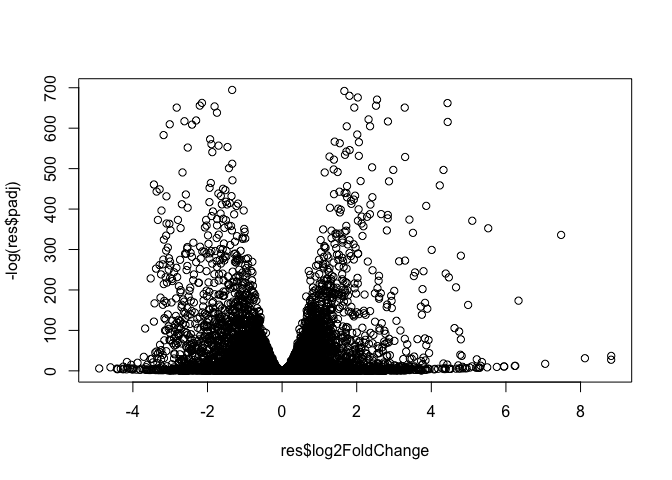
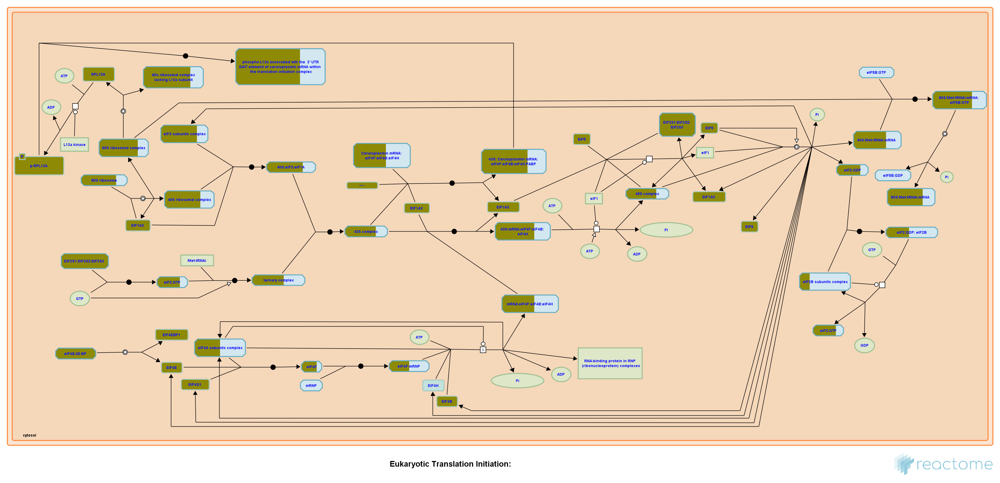

# Class 14: RNASeq Mini Project
Emily Hendrickson (PID: A69034780)

\##Import data

Counts Metadata

``` r
counts <- read.csv("GSE37704_featurecounts.csv", row.names = 1)
metadata <- read.csv("GSE37704_metadata.csv")
```

\##Data cleanup

``` r
head(counts)
```

                    length SRR493366 SRR493367 SRR493368 SRR493369 SRR493370
    ENSG00000186092    918         0         0         0         0         0
    ENSG00000279928    718         0         0         0         0         0
    ENSG00000279457   1982        23        28        29        29        28
    ENSG00000278566    939         0         0         0         0         0
    ENSG00000273547    939         0         0         0         0         0
    ENSG00000187634   3214       124       123       205       207       212
                    SRR493371
    ENSG00000186092         0
    ENSG00000279928         0
    ENSG00000279457        46
    ENSG00000278566         0
    ENSG00000273547         0
    ENSG00000187634       258

``` r
head(metadata)
```

             id     condition
    1 SRR493366 control_sirna
    2 SRR493367 control_sirna
    3 SRR493368 control_sirna
    4 SRR493369      hoxa1_kd
    5 SRR493370      hoxa1_kd
    6 SRR493371      hoxa1_kd

The columns in the count file should match the rows in metadata. We have
to remove the lengths column.

``` r
countData <- counts[,-1]
head(countData)
```

                    SRR493366 SRR493367 SRR493368 SRR493369 SRR493370 SRR493371
    ENSG00000186092         0         0         0         0         0         0
    ENSG00000279928         0         0         0         0         0         0
    ENSG00000279457        23        28        29        29        28        46
    ENSG00000278566         0         0         0         0         0         0
    ENSG00000273547         0         0         0         0         0         0
    ENSG00000187634       124       123       205       207       212       258

Check that metadata matches count data.

``` r
#| label: Checking metadata = count

all(colnames(countData) == metadata$id)
```

    [1] TRUE

\###Filter out zero counts

``` r
tp.keep.inds <- rowSums(countData) > 0
cleanCounts <- countData[tp.keep.inds,]
head(cleanCounts)
```

                    SRR493366 SRR493367 SRR493368 SRR493369 SRR493370 SRR493371
    ENSG00000279457        23        28        29        29        28        46
    ENSG00000187634       124       123       205       207       212       258
    ENSG00000188976      1637      1831      2383      1226      1326      1504
    ENSG00000187961       120       153       180       236       255       357
    ENSG00000187583        24        48        65        44        48        64
    ENSG00000187642         4         9        16        14        16        16

\##Setup DESeq object

``` r
#|message: false
library(DESeq2) 
```

    Loading required package: S4Vectors

    Loading required package: stats4

    Loading required package: BiocGenerics


    Attaching package: 'BiocGenerics'

    The following objects are masked from 'package:stats':

        IQR, mad, sd, var, xtabs

    The following objects are masked from 'package:base':

        anyDuplicated, aperm, append, as.data.frame, basename, cbind,
        colnames, dirname, do.call, duplicated, eval, evalq, Filter, Find,
        get, grep, grepl, intersect, is.unsorted, lapply, Map, mapply,
        match, mget, order, paste, pmax, pmax.int, pmin, pmin.int,
        Position, rank, rbind, Reduce, rownames, sapply, setdiff, sort,
        table, tapply, union, unique, unsplit, which.max, which.min


    Attaching package: 'S4Vectors'

    The following object is masked from 'package:utils':

        findMatches

    The following objects are masked from 'package:base':

        expand.grid, I, unname

    Loading required package: IRanges

    Loading required package: GenomicRanges

    Loading required package: GenomeInfoDb

    Loading required package: SummarizedExperiment

    Loading required package: MatrixGenerics

    Loading required package: matrixStats

    Warning: package 'matrixStats' was built under R version 4.3.3


    Attaching package: 'MatrixGenerics'

    The following objects are masked from 'package:matrixStats':

        colAlls, colAnyNAs, colAnys, colAvgsPerRowSet, colCollapse,
        colCounts, colCummaxs, colCummins, colCumprods, colCumsums,
        colDiffs, colIQRDiffs, colIQRs, colLogSumExps, colMadDiffs,
        colMads, colMaxs, colMeans2, colMedians, colMins, colOrderStats,
        colProds, colQuantiles, colRanges, colRanks, colSdDiffs, colSds,
        colSums2, colTabulates, colVarDiffs, colVars, colWeightedMads,
        colWeightedMeans, colWeightedMedians, colWeightedSds,
        colWeightedVars, rowAlls, rowAnyNAs, rowAnys, rowAvgsPerColSet,
        rowCollapse, rowCounts, rowCummaxs, rowCummins, rowCumprods,
        rowCumsums, rowDiffs, rowIQRDiffs, rowIQRs, rowLogSumExps,
        rowMadDiffs, rowMads, rowMaxs, rowMeans2, rowMedians, rowMins,
        rowOrderStats, rowProds, rowQuantiles, rowRanges, rowRanks,
        rowSdDiffs, rowSds, rowSums2, rowTabulates, rowVarDiffs, rowVars,
        rowWeightedMads, rowWeightedMeans, rowWeightedMedians,
        rowWeightedSds, rowWeightedVars

    Loading required package: Biobase

    Welcome to Bioconductor

        Vignettes contain introductory material; view with
        'browseVignettes()'. To cite Bioconductor, see
        'citation("Biobase")', and for packages 'citation("pkgname")'.


    Attaching package: 'Biobase'

    The following object is masked from 'package:MatrixGenerics':

        rowMedians

    The following objects are masked from 'package:matrixStats':

        anyMissing, rowMedians

``` r
dds <- DESeqDataSetFromMatrix(countData = countData,
                              colData = metadata,
                              design = ~condition)
```

    Warning in DESeqDataSet(se, design = design, ignoreRank): some variables in
    design formula are characters, converting to factors

``` r
dds <- DESeq(dds)
```

    estimating size factors

    estimating dispersions

    gene-wise dispersion estimates

    mean-dispersion relationship

    final dispersion estimates

    fitting model and testing

``` r
res <- results(dds)
```

\##Inspect results

``` r
head(res)
```

    log2 fold change (MLE): condition hoxa1 kd vs control sirna 
    Wald test p-value: condition hoxa1 kd vs control sirna 
    DataFrame with 6 rows and 6 columns
                     baseMean log2FoldChange     lfcSE      stat     pvalue
                    <numeric>      <numeric> <numeric> <numeric>  <numeric>
    ENSG00000186092    0.0000             NA        NA        NA         NA
    ENSG00000279928    0.0000             NA        NA        NA         NA
    ENSG00000279457   29.9136       0.179257  0.324822  0.551863 0.58104205
    ENSG00000278566    0.0000             NA        NA        NA         NA
    ENSG00000273547    0.0000             NA        NA        NA         NA
    ENSG00000187634  183.2296       0.426457  0.140266  3.040350 0.00236304
                          padj
                     <numeric>
    ENSG00000186092         NA
    ENSG00000279928         NA
    ENSG00000279457 0.68707978
    ENSG00000278566         NA
    ENSG00000273547         NA
    ENSG00000187634 0.00516278

``` r
plot(res$log2FoldChange, -log(res$padj))
```



\##Pathway Analysis

Annotate genes in data, mapping to SYMBOL, ENTREZID, GENENAME

``` r
library(AnnotationDbi)
library(org.Hs.eg.db)
```

``` r
res$symbol <- mapIds(org.Hs.eg.db,
                     keys = row.names(res),
                     keytype = "ENSEMBL",
                     column = "SYMBOL",
                     multiVals = "first")
```

    'select()' returned 1:many mapping between keys and columns

``` r
res$genename <- mapIds(org.Hs.eg.db, 
                       keys = row.names(res),
                       keytype = "ENSEMBL",
                       column = "GENENAME",
                       multiVals = "first")
```

    'select()' returned 1:many mapping between keys and columns

``` r
res$entrezid <- mapIds(org.Hs.eg.db,
                       keys = row.names(res),
                       keytype = "ENSEMBL",
                       column = "ENTREZID",
                       multiVals = "first")
```

    'select()' returned 1:many mapping between keys and columns

``` r
head(res)
```

    log2 fold change (MLE): condition hoxa1 kd vs control sirna 
    Wald test p-value: condition hoxa1 kd vs control sirna 
    DataFrame with 6 rows and 9 columns
                     baseMean log2FoldChange     lfcSE      stat     pvalue
                    <numeric>      <numeric> <numeric> <numeric>  <numeric>
    ENSG00000186092    0.0000             NA        NA        NA         NA
    ENSG00000279928    0.0000             NA        NA        NA         NA
    ENSG00000279457   29.9136       0.179257  0.324822  0.551863 0.58104205
    ENSG00000278566    0.0000             NA        NA        NA         NA
    ENSG00000273547    0.0000             NA        NA        NA         NA
    ENSG00000187634  183.2296       0.426457  0.140266  3.040350 0.00236304
                          padj      symbol               genename    entrezid
                     <numeric> <character>            <character> <character>
    ENSG00000186092         NA       OR4F5 olfactory receptor f..       79501
    ENSG00000279928         NA          NA                     NA          NA
    ENSG00000279457 0.68707978          NA                     NA          NA
    ENSG00000278566         NA          NA                     NA          NA
    ENSG00000273547         NA          NA                     NA          NA
    ENSG00000187634 0.00516278      SAMD11 sterile alpha motif ..      148398

Pull out “top” hits with adjusted p-value \< 0.05 and log2FoldChange \<
2

``` r
top.inds <- (abs(res$log2FoldChange) > 2) & (abs(res$padj) < 0.05)

top.inds[is.na(top.inds)] <- FALSE

top.genes <- res[top.inds,]
write.csv(top.genes, file = "top_geneset.csv")
head(top.genes)
```

    log2 fold change (MLE): condition hoxa1 kd vs control sirna 
    Wald test p-value: condition hoxa1 kd vs control sirna 
    DataFrame with 6 rows and 9 columns
                     baseMean log2FoldChange     lfcSE      stat      pvalue
                    <numeric>      <numeric> <numeric> <numeric>   <numeric>
    ENSG00000188290 108.92213        2.05706  0.196905  10.44697 1.51282e-25
    ENSG00000069812   3.15811        2.95472  1.297925   2.27650 2.28163e-02
    ENSG00000162490  12.97464        3.04771  0.655649   4.64838 3.34549e-06
    ENSG00000158825  13.82864       -4.04437  0.759756  -5.32325 1.01932e-07
    ENSG00000020633   8.52787        2.85926  0.789747   3.62047 2.94066e-04
    ENSG00000127423  20.80883       -2.01707  0.455301  -4.43018 9.41540e-06
                           padj      symbol               genename    entrezid
                      <numeric> <character>            <character> <character>
    ENSG00000188290 1.30680e-24        HES4 hes family bHLH tran..       57801
    ENSG00000069812 4.19950e-02        HES2 hes family bHLH tran..       54626
    ENSG00000162490 1.02087e-05      DRAXIN dorsal inhibitory ax..      374946
    ENSG00000158825 3.54777e-07         CDA     cytidine deaminase         978
    ENSG00000020633 7.24558e-04       RUNX3 RUNX family transcri..         864
    ENSG00000127423 2.73886e-05       AUNIP aurora kinase A and ..       79000

Now we can start the analysis

``` r
#|message: false

library(pathview)
```

    ##############################################################################
    Pathview is an open source software package distributed under GNU General
    Public License version 3 (GPLv3). Details of GPLv3 is available at
    http://www.gnu.org/licenses/gpl-3.0.html. Particullary, users are required to
    formally cite the original Pathview paper (not just mention it) in publications
    or products. For details, do citation("pathview") within R.

    The pathview downloads and uses KEGG data. Non-academic uses may require a KEGG
    license agreement (details at http://www.kegg.jp/kegg/legal.html).
    ##############################################################################

``` r
library(gage)
```

``` r
library(gageData)

data(kegg.sets.hs)
data(sigmet.idx.hs)

kegg.sets.hs = kegg.sets.hs[sigmet.idx.hs]
```

*gage* input is a vector of imortance with gene names as labels. KEGG
uses entrez

``` r
foldchanges <- res$log2FoldChange
names(foldchanges) <- res$entrezid
head(foldchanges)
```

        79501      <NA>      <NA>      <NA>      <NA>    148398 
           NA        NA 0.1792571        NA        NA 0.4264571 

``` r
keggres <- gage(foldchanges, gsets = kegg.sets.hs)

attributes(keggres)
```

    $names
    [1] "greater" "less"    "stats"  

``` r
head(keggres$less)
```

                                             p.geomean stat.mean        p.val
    hsa04110 Cell cycle                   7.077982e-06 -4.432593 7.077982e-06
    hsa03030 DNA replication              9.424076e-05 -3.951803 9.424076e-05
    hsa03013 RNA transport                1.048017e-03 -3.112129 1.048017e-03
    hsa04114 Oocyte meiosis               2.563806e-03 -2.827297 2.563806e-03
    hsa03440 Homologous recombination     3.066756e-03 -2.852899 3.066756e-03
    hsa00010 Glycolysis / Gluconeogenesis 4.360092e-03 -2.663825 4.360092e-03
                                                q.val set.size         exp1
    hsa04110 Cell cycle                   0.001160789      124 7.077982e-06
    hsa03030 DNA replication              0.007727742       36 9.424076e-05
    hsa03013 RNA transport                0.057291598      149 1.048017e-03
    hsa04114 Oocyte meiosis               0.100589607      112 2.563806e-03
    hsa03440 Homologous recombination     0.100589607       28 3.066756e-03
    hsa00010 Glycolysis / Gluconeogenesis 0.119175854       65 4.360092e-03

``` r
pathview(foldchanges, pathway.id = "hsa04110")
```

    'select()' returned 1:1 mapping between keys and columns

    Info: Working in directory /Users/emilyhendrickson/Documents/UCSD/Courses/BGGN213/Week9/bggn213_github/class14

    Info: Writing image file hsa04110.pathview.png

Biological processes subset of GO

``` r
data(go.sets.hs)
data(go.subs.hs)

gobpsets = go.sets.hs[go.subs.hs$BP]

gores = gage(foldchanges, gsets=gobpsets, same.dir=TRUE)

head(gores$less)
```

                                                p.geomean stat.mean        p.val
    GO:0048285 organelle fission             6.386337e-16 -8.175381 6.386337e-16
    GO:0000280 nuclear division              1.726380e-15 -8.056666 1.726380e-15
    GO:0007067 mitosis                       1.726380e-15 -8.056666 1.726380e-15
    GO:0000087 M phase of mitotic cell cycle 4.593581e-15 -7.919909 4.593581e-15
    GO:0007059 chromosome segregation        9.576332e-12 -6.994852 9.576332e-12
    GO:0051301 cell division                 8.718528e-11 -6.455491 8.718528e-11
                                                    q.val set.size         exp1
    GO:0048285 organelle fission             2.515911e-12      386 6.386337e-16
    GO:0000280 nuclear division              2.515911e-12      362 1.726380e-15
    GO:0007067 mitosis                       2.515911e-12      362 1.726380e-15
    GO:0000087 M phase of mitotic cell cycle 5.020784e-12      373 4.593581e-15
    GO:0007059 chromosome segregation        8.373545e-09      146 9.576332e-12
    GO:0051301 cell division                 6.352901e-08      479 8.718528e-11

``` r
head(gores$greater)
```

                                                  p.geomean stat.mean        p.val
    GO:0007156 homophilic cell adhesion        1.624062e-05  4.226117 1.624062e-05
    GO:0048729 tissue morphogenesis            5.407952e-05  3.888470 5.407952e-05
    GO:0002009 morphogenesis of an epithelium  5.727599e-05  3.878706 5.727599e-05
    GO:0030855 epithelial cell differentiation 2.053700e-04  3.554776 2.053700e-04
    GO:0060562 epithelial tube morphogenesis   2.927804e-04  3.458463 2.927804e-04
    GO:0048598 embryonic morphogenesis         2.959270e-04  3.446527 2.959270e-04
                                                    q.val set.size         exp1
    GO:0007156 homophilic cell adhesion        0.07100398      138 1.624062e-05
    GO:0048729 tissue morphogenesis            0.08347021      483 5.407952e-05
    GO:0002009 morphogenesis of an epithelium  0.08347021      382 5.727599e-05
    GO:0030855 epithelial cell differentiation 0.16449701      299 2.053700e-04
    GO:0060562 epithelial tube morphogenesis   0.16449701      289 2.927804e-04
    GO:0048598 embryonic morphogenesis         0.16449701      498 2.959270e-04

``` r
sig_genes <- res[res$padj <= 0.05 & !is.na(res$padj), "symbol"]
print(paste("Total number of significant genes:", length(sig_genes)))
```

    [1] "Total number of significant genes: 8146"

``` r
write.table(sig_genes, file="significant_genes.txt", row.names=FALSE, col.names=FALSE, quote=FALSE)
```


